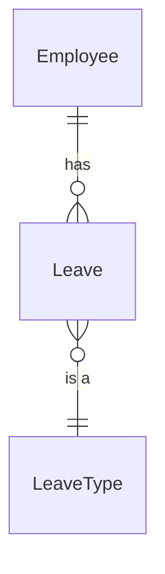

# Module Documentation Guide

**Target module: `$ARGUMENTS`** (e.g. `Attendance`, `Notifications`). If empty,
ask which module to document.

Instructions for documenting a module — either scaffolding docs for a **new**
module or backfilling them on an **existing** one. Follow this when asked to
"document module X", "add module docs", or when creating a new module.

A "module" is a cohesive feature area. It can be a standalone Core project
(`MojaDigitalnaFirma.Core.Attendance`) or a feature folder inside a portal
(`…HBCleaning.AdminPortal/…/complaint`). The docs live in the module's own
folder either way — next to the code they describe.

---

## Guiding principles (read first)

1. **Living docs vs. review snapshots.** These four files hold the slow-changing
   *why* and *how*. They must NOT contain point-in-time data (coverage %,
   `file:line` findings, "current bugs") — that belongs in disposable
   `review/{{module}}/` output. A doc that photographs today's state lies with
   authority tomorrow.
2. **Durable columns only.** Any table here uses columns that rarely change
   (name, purpose, file path). Leave out volatile columns (auth role, test
   status, coverage ticks) — those churn every PR.
3. **Minimize files.** Every `.md` is a maintenance liability. A simple CRUD
   module gets `README.md` + a short `summary.md` only. Graduate to
   `domain-map.md` / `testing.md` *only* when there's real domain logic or
   bespoke test infrastructure. Don't scaffold empty ceremony.
4. **The read funnel.** The files are ordered so an agent spends the least
   context to find what it needs:
   `summary.md` (orient) → `domain-map.md` navigation index (locate the file) →
   the actual source file. Write each file to serve its rung of that funnel.
5. **No build impact.** `.md` files in module folders are never compiled or
   copied to output by the .NET SDK. Just commit them in place.

---

## The four files

| File | Audience | Required? | Holds |
|---|---|---|---|
| `README.md` | **Human** | Always | Setup, how to run, business intro, links to the rest |
| `summary.md` | **Agent entry point** | Always | 2-line purpose · dependency seams · gotchas · extension playbook · links |
| `domain-map.md` | Agent deep ref | When domain is non-trivial | Model · invariants · business rules · glossary · navigation index |
| `testing.md` | Agent | When test infra/gaps warrant | Test strategy · fixtures/helpers · living KnownGaps |

After writing/updating them, add or refresh the module's row in the
`docs/modules.md` registry.

---

## Templates

### `README.md` (human-facing)

```markdown
# {{Module}}

> One sentence: what this module is, in business terms.

## What it does
2–4 sentences of business context. Why it exists, who uses it.

## Setup / running
Anything module-specific to get it running locally (migrations to apply, seed
data, config keys, feature flags). If nothing special: "No module-specific
setup — see root README."

## Docs
- `summary.md` — start here if you're working in this module
- `domain-map.md` — model, invariants, business rules, file index
- `testing.md` — how to test this module
```

### `summary.md` (agent entry point — keep it prose and short)

```markdown
# {{Module}} — Agent Summary

**Purpose:** 1–2 lines.

**Bounded context:** what this module owns vs. explicitly does NOT own.

## Dependency seams
- **Consumes:** {{OtherModule}} for {{what invariant/data}} (e.g. Attendance
  reads Employee.DailyWorkHours).
- **Exposes:** {{what}} to {{whom}}.
- **Cross-module contracts:** Kernel interfaces, published events, etc.

## Gotchas — things that will bite you
The non-obvious constraints. Examples:
- "Every write to X must call `RefreshAttendanceViewAsync`."
- "Leave writes are transactional with balance mutation — don't split them."
- "Don't use `ExecuteUpdateAsync` here — it bypasses the audit interceptor."

## Extension playbook
Recipes for the common changes, step by step. Examples:
- **Add a new {{Entity}}:** 1) … 2) … 3) …
- **Add an endpoint:** which base class, where to register, what to test.

## Deeper reference
- `domain-map.md` — model, invariants, business rules, file index
- `testing.md` — test strategy and known gaps
```

### `domain-map.md` (agent deep reference)

```markdown
# {{Module}} — Domain Map

## Model
Mermaid diagram of entities, relationships, cardinalities, key fields.
(Prefer Mermaid over ASCII — it renders in GitHub/Rider and is easier to keep
correct.)



## Invariants
Each invariant the code assumes — and whether it's **DB-enforced** (constraint)
or only **app-enforced** (or not enforced at all). This is exactly the gap that
causes data-corruption bugs.

- `AttendanceCalendar.Date` unique per year — *app-enforced only (no DB constraint)*.
- …

## Business rules / domain logic
The actual *why* — the rules an agent must not break when fixing a bug. Cite the
external spec where one exists (e.g. Slovak Labour Code §97 overtime cap, §113
carry-over consumption order). State the rule in plain language, then where it's
enforced in code.

## Glossary
Domain term → meaning → code name. Essential for a Slovak business domain.

| Term | Meaning | Code |
|---|---|---|
| Dovolenka | Paid annual leave | `LeaveType.Vacation` |
| otcovské voľno | Paternity time off (2 weeks) | … |

## Navigation index
The map's payload: every endpoint / handler / service / job / seeder, so an
agent can decide what to open WITHOUT reading it. **Durable columns only** —
no auth/test/coverage columns (those live in `review/`).

| Name | Kind | Responsibility | Path |
|---|---|---|---|
| AddLeaveEndpoint | Endpoint | Create leave + mutate balance (tx) | `application/endpoint/leave/command/AddLeaveEndpoint.cs` |
| WorkLogComplianceChecker | Service | Daily-rest & yearly-overtime checks | `application/service/WorkLogComplianceChecker.cs` |
```

### `testing.md` (when warranted)

```markdown
# {{Module}} — Testing

## How to test this module
Which fixtures, helpers, auth handlers apply (per root `docs/testing.md`).
Anything bespoke (e.g. the materialized-view fixture patch, ownership testing
via `UserRoleTestAuthHandler`).

## Strategy
What's worth integration-testing here vs. unit; which base test classes
(`BaseGridEndpointTests`, etc.) cover which endpoints.

## Known gaps (living list)
The `[Trait("Status","KnownGap")]` items, kept current. Short, decision-level —
NOT a coverage matrix (that's a `review/` artifact).

- RolloverLeaveBalancesCommandHandler — no tests yet.
- …
```

---

## Procedure

1. Read the module folder (and its tests). Identify whether it's domain-trivial
   (→ two files) or domain-rich (→ all four).
2. Write `README.md` and `summary.md` always.
3. Add `domain-map.md` if there are real entities/invariants/rules; build the
   navigation index by listing every endpoint/handler/service with a one-line
   purpose + path.
4. Add `testing.md` if there's bespoke test infra or known gaps.
5. Register the module in `docs/modules.md`.
6. Keep it honest: if you don't know a business rule, mark it `TODO: confirm with
   product` rather than inventing one.
