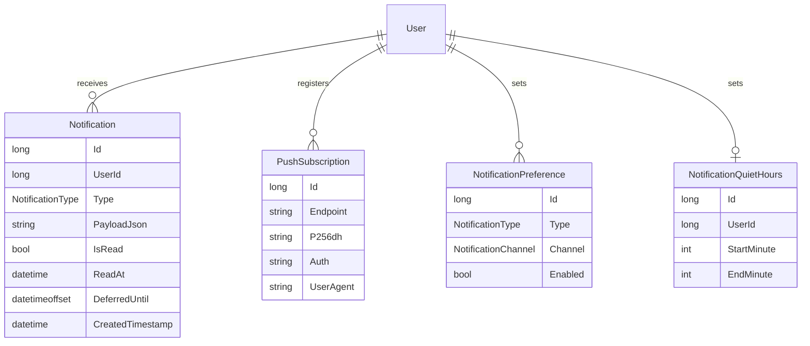

# Notifications — Domain Map

## Architecture (dispatch flow)

```
any module ──► INotificationService.NotifyAsync(recipients, type, payload)   [Sydowwe.Framework.Contracts contract]
                     │   (impl: Core.Notifications/infrastructure/NotificationService)
                     ├─ resolve recipients (user / role / everyone) via UserManager<User>
                     ├─ for each recipient: load NotificationPreference, skip disabled channels
                     ├─ render (title, body) from type + payload   [INotificationTextRenderer]
                     ├─ persist a Notification row (history + bell + fallback)
                     ├─ InApp  → IHubContext<NotificationHub>.Clients.User(id)   (live)
                     ├─ WebPush → IWebPushSender per PushSubscription (VAPID)     (background)
                     └─ Email  → INotificationEmailSender per address (SMTP)      (out-of-app)
```

Three delivery channels solve different cases and are **all** needed:

| Channel   | Transport                 | Works when app is…   | Notes                                                                            |
|-----------|---------------------------|----------------------|----------------------------------------------------------------------------------|
| `InApp`   | SignalR WebSocket         | **open / connected** | bell, live toast. No reach to a closed app.                                      |
| `WebPush` | Web Push + service worker | **open or closed**   | OS/browser delivers; no Firebase. iOS needs an installed PWA.                    |
| `Email`   | SMTP (MailKit)            | **never installed**  | the only channel for someone who won't install the PWA. Per-type defaults below. |

### Email channel defaults (per type)

InApp and WebPush are default-ON for every type. Email is **not** — a mailbox is a shared, permanent, noisy surface, so only types that need to reach someone with the app closed default on. The matrix
lives in `application/NotificationChannelDefaults.cs`:

| Email default | Types                                                                                                                                                                                                                        |
|---------------|------------------------------------------------------------------------------------------------------------------------------------------------------------------------------------------------------------------------------|
| **ON**        | `LeavePending`, `LeaveApproved`, `LeaveRejected`, `WorkLogApproved`, `WorkLogRejected`, `WorkLogComplianceBreach`, `DeadlineApproaching`, `RegistratoryDisposalDue`, `StockLow`, `ScheduledJobFailed`, `ScheduledJobOverdue` |
| **OFF**       | `ReminderDigest`, `UpcomingHrEvents`, `Test`, and any unknown/future type (safe default)                                                                                                                                     |

⚠️ The two `ScheduledJob*` types are default-on **contingent on their throttles** (scheduler follow-ups 06/D2 and 08): `ScheduledJobFailed` on `JobAlertThrottle.Window` (1 h) and `ScheduledJobOverdue`
on
`OverdueJobSweep:AlertThrottleHours` (12 h — an overdue condition persists *continuously* until fixed, so an hourly repeat would be 24 mails a day per Admin). Shortening either window means revisiting
its row here.

An explicit `NotificationPreference` row always wins, in **both** directions. The channel short-circuits entirely when SMTP is unconfigured (`EmailNotificationOptions.IsConfigured`), exactly like
unconfigured Web Push — the SMTP sender is never even constructed, because its ctor throws on missing MAIL_* env vars.

> ⚠️ **Legal:** the default-ON set is lawful only because every member is an *operational* notification
> about the recipient's own work. Marketing content must be opt- **IN** (consent) per §116 zák. 452/2021 —
> never extend this matrix to a marketing type.

## Model



`NotificationPreference` is a per-user, per-`(Type, Channel)` row.

`NotificationQuietHours` is **at most one row per user** (unique index on `UserId`), minutes-from-local-midnight in `Application:Timezone`, `Start > End` = overnight. It is the **single** quiet-hours
window in the deployment:
Reminders migrated its own `ReminderQuietHours` table into this one and reads it through
`Sydowwe.Framework.Contracts.notification.IQuietHoursReader`. Unlike this module's other user-keyed tables it has **no FK** to the user table — see the entity's remarks for why.

## Invariants

- A `Notification` persists `Type` + JSON `payload`, never rendered text (locale-agnostic). *App-enforced.*
- A payload persists entity **ids, never person names** — display text is resolved per render by `INotificationPayloadEnricher`, so the row carries no PII that could outlive GDPR erasure.
  *App-enforced (convention at the call sites).*
- Preference **absence = the channel's per-type default** (all-on for InApp/WebPush; per-type for Email, see the matrix above). An explicit row wins in both directions. *App-enforced in the
  dispatcher.*
- **All three** channels off for a recipient → no history row written. *App-enforced.*
- A `PushSubscription` returning `404/410` is deleted on next send (lazy prune). *App-enforced.*
- **History is time-bounded** (GDPR Art. 5 (1)(e)): a `Notification` never outlives 90d once read, nor 365d in any state; a `PushSubscription` never outlives 180d without being re-POSTed. *Enforced by
  the daily `Notifications.PurgeExpiredHistory` job — on a host with no Quartz substrate the job never runs and history is unbounded.*
- A `PushSubscription`'s `ModifiedTimestamp` is its **last-seen instant**, not just a row-change marker:
  `SubscribePushEndpoint` force-touches it on every re-POST, including one that changes nothing. The stale-prune above depends on this. *App-enforced.*
- `NotificationPreference` / `NotificationQuietHours` are **never purged** — settings, not history; expiring an opt-out or a window would silently re-enable something the user switched off.
  *App-enforced (the purge simply never touches them).*
- A recipient inside their quiet-hours window at send time still gets the **history row and the InApp push immediately**; only Web Push + Email are withheld, via `Notification.DeferredUntil`. Quiet
  hours never *drop* a notification. *App-enforced in the dispatcher.*
- `DeferredUntil` is set **only** for recipients whose Web Push or Email channel is enabled — an InApp-only recipient is never deferred. *App-enforced.*
- `DeferredUntil` is **frozen at send time**: later edits to (or deletion of) the window do not move an already-stamped deferral. Channel *preferences*, by contrast, are re-evaluated at flush time.
  *App-enforced.*
- A row with `DeferredUntil <= now` is delivered and the column cleared, so the sweep is idempotent and a notification's background channels fire **at most twice** only if the process dies mid-flush
  (deliver-then-clear is deliberate: at-least-once beats silently dropping). *Enforced by the 15-minute
  `Notifications.FlushDeferredNotifications` job — on a host with no Quartz substrate the job never runs and deferred background deliveries never arrive.*
- The bell / `mine` list, the unread count and `read-all` all **ignore** `DeferredUntil`. *App-enforced.*

## Recipients (`NotificationRecipients`)

| Factory                          | Targets                                                                            |
|----------------------------------|------------------------------------------------------------------------------------|
| `User(long id)`                  | one user                                                                           |
| `Users(IEnumerable<long>)`       | an explicit set                                                                    |
| `InRole(UserRoleEnum role)`      | everyone holding that role                                                         |
| `InRoles(params UserRoleEnum[])` | everyone holding **any** of the roles (deduplicated — e.g. an "HR or higher" gate) |
| `Admins()`                       | shorthand for `InRole(UserRoleEnum.Admin)`                                         |
| `Everyone()`                     | all users                                                                          |

## Payload + localization

The persisted `Notification` stores `Type` + a JSON `payload` — **not** finished text — so it stays locale-agnostic. `INotificationTextRenderer.Render(type, payloadJson)`
produces `(Title, Body)` at send/read time. v1 (`NotificationTextRenderer`) returns sk-SK strings; to localize per recipient, replace it with an `IStringLocalizer`-backed implementation keyed on the
user's culture. Whatever properties your payload carries (e.g. `itemName`, `title`, `message`) must match what the renderer reads for that type.

### Payload minimization (ids, never person names)

A payload persists **`employeeId`**, never `employeeName`. The reason is GDPR, not style:
a notification row is owned by its **recipient** (HR, the approving manager), so
`IEmployeeErasureService` — which walks rows belonging to the *erased* employee — never reaches it. A name written into the JSON would outlive anonymization indefinitely (audit 2026-07, finding L1).

The name is instead resolved **per render** by `INotificationPayloadEnricher`
(`Sydowwe.Framework.Contracts/notification/`), which runs immediately before `renderer.Render(...)` at both render points and overlays `employeeName` into the JSON in memory — the renderer itself is unchanged, and **the
enriched JSON is never written back**:

```
NotificationService.NotifyAsync ──► enrich([payloadJson])       ──► render ──► persist RAW payload
GET /notification/mine (≤50 rows) ──► enrich(all page payloads) ──► render per row
```

| Concern             | Behavior                                                                                                                                                      |
|---------------------|---------------------------------------------------------------------------------------------------------------------------------------------------------------|
| Implementation      | `EmployeeNamePayloadEnricher` (Core.EmployeeModule) via the `GetEmployeeSummariesCommand` read seam — **one** dispatch per batch, distinct ids                |
| Fallback            | `NoOpNotificationPayloadEnricher` (this module), wired with `TryAddScoped` so the real impl always wins — see `CoreServiceExtensions`                         |
| Fast path           | No payload in the batch carries `employeeId` → returns immediately, no dispatch (digest / stock / registratúra senders)                                       |
| No `HttpContext`    | The FE command bus needs an ambient one; without it the enricher logs a warning and returns payloads unchanged → renderer's name-less text. **Never throws.** |
| Anonymized employee | Seam returns the tombstoned name, so the render degrades on its own — no backfill, no payload scrubber                                                        |
| Unresolvable id     | Payload left untouched → name-less fallback                                                                                                                   |

Core.Notifications must **not** reference Core.EmployeeModule — the contract lives in `Sydowwe.Framework.Contracts` for exactly this reason. Existing rows written before this change are not backfilled; the retention purge
ages them out (accepted windowed residual).

#### The rule is type-enforced, not a call-site convention

Minimization used to rest on every producer *choosing* to write `new { employeeId = … }`. It no longer does. `INotificationService` takes an **`INotificationPayload`**, never an
`object`, so an anonymous object carrying a name does not compile:

| Piece                                                      | Where                            | What it buys                                                                                                                         |
|------------------------------------------------------------|----------------------------------|--------------------------------------------------------------------------------------------------------------------------------------|
| `INotificationPayload` + one record per `NotificationType` | `Sydowwe.Framework.Contracts/notification/payload/` | The single statement of the rule; producers can only send a declared shape                                                           |
| `[NotificationPayload(type)]`                              | same                             | The typed `NotifyAsync<T>` derives the kind, so type and payload cannot disagree                                                     |
| `IReminderPayload`                                         | `Sydowwe.Framework.Contracts/reminders/`              | Same rule on `ReminderRegistration.Payload` — **there is no Reminders exception any more**                                           |
| `PayloadPiiContractGuardTests`                             | `HBCleaning.Tests/unit/payload/` | Reflection over both markers; fails on a person-data property name (SK + EN). This is what stops `EmployeeName` being added tomorrow |
| `PayloadPersonDataNames`                                   | `Sydowwe.Framework.Contracts/notification/payload/`   | One name list, shared by the guard test and the runtime check below                                                                  |

`employeeName` is deliberately **absent from every payload record**: it is not payload, it is the enricher's render-time overlay, and `NotificationTextRenderer` reads it off the raw document rather
than off the record. That separation is exactly what lets the guard assert that no *persisted* payload names anybody.

Two paths are enforced at runtime instead, because the compiler cannot reach them:

- **`POST /reminder-definition/register`** (manual-ops) accepts a free-form JSON payload from an admin. It is wrapped in `RawReminderPayload` and rejected with a **400** if any key matches a
  person-data name. This is the only registration path without a compile-time guarantee.
- **`RawNotificationPayload`** is rehydration, not authoring: Reminders dispatch forwards a document already written through the guarded registration seam. It is not an escape hatch.

**Scheduler is deliberately not typed.** `ScheduledJob.PayloadJson` is handler *configuration*
("purge older than X"), not per-subject content — MEDIUM, not HIGH, in the scheduler review. It references this rule from its XML doc and keeps `[AuditIgnore]`; typing job payloads is a recorded
residual, not something that column claims to guarantee.

## Preferences / opt-out

`NotificationPreference` is per-user, per-`(Type, Channel)`. **Absence means the channel's per-type default** — all-on for InApp/WebPush, per-type for Email (see the defaults matrix above); an
explicit row overrides it in either direction. Users read the full effective matrix via `GET /api/notification-preference/mine` (one entry per (type, channel) enum pair — the same effective-state rule
the dispatcher applies, so the SPA never disagrees with what actually gets sent) and write opt-outs via `PUT /api/notification-preference`. The dispatcher skips a channel when its preference is
disabled, and skips the recipient entirely (no history row) when **all three** channels are off.

## Endpoints

| Method | Route (under `/api`)             | Purpose                                                                                                       | Roles    |
|--------|----------------------------------|---------------------------------------------------------------------------------------------------------------|----------|
| POST   | `/push-subscription`             | register/refresh this device's Web Push subscription                                                          | any user |
| POST   | `/push-subscription/unsubscribe` | remove a subscription                                                                                         | any user |
| GET    | `/notification/mine`             | recent notifications (bell list, ≤`limit` default 50, max 100); optional `beforeId`/`limit` keyset pagination | any user |
| GET    | `/notification/unread-count`     | uncapped count of the caller's unread notifications                                                           | any user |
| POST   | `/notification/read-all`         | mark all of the caller's notifications read (idempotent)                                                      | any user |
| DELETE | `/notification/{id}`             | hard-delete one notification (owner-scoped)                                                                   | any user |
| PATCH  | `/notification/{id}/read`        | mark one read (owner-scoped)                                                                                  | any user |
| GET    | `/notification-preference/mine`  | full (type × channel) effective preference matrix — doubles as the catalog                                    | any user |
| PUT    | `/notification-preference`       | upsert a (type, channel) opt-out                                                                              | any user |
| GET    | `/notification-quiet-hours`      | the caller's quiet-hours window (`null` when unset)                                                           | any user |
| PUT    | `/notification-quiet-hours`      | set the caller's window (`Start == End` / out-of-range → 400)                                                 | any user |
| DELETE | `/notification-quiet-hours`      | clear the caller's window (idempotent)                                                                        | any user |
| POST   | `/notification/test`             | send a Test notification to self (dev/QA)                                                                     | Admin+   |

The three quiet-hours routes are **owner-scoped by construction**: no user id appears in the route or the body, every read/write is keyed by `User.GetId()`, so there is no cross-user path to test for.
(The window used to live at `PUT /reminder-preference/quiet-hours`; that endpoint is gone.)

**SSRF guard on `POST /push-subscription`:** the endpoint validates that `Endpoint` uses HTTPS and that the host does not resolve to a loopback, RFC-1918 private, or link-local address. The guard
resolves the hostname via DNS and rejects the request if **any** resolved address is in a private range (covers the cloud metadata address `169.254.169.254`). Hosts that fail DNS resolution are
allowed (reserved test domains cannot reach internal targets). Residual risk: a TOCTOU window exists between validation and the actual outbound send from
`WebPushSender`; mitigate in production with an egress firewall that blocks private ranges.

SignalR hub: `/hubs/notifications`. The server pushes method `ReceiveNotification` with a `NotificationDto { id, type, title, body, createdAt, isRead }`. Authenticated with the same httpOnly
`auth-token` cookie as the REST API — the browser sends it on the WebSocket handshake, so the SPA connects with `withCredentials: true` and **no**
`accessTokenFactory`. (SPA and API are same-site — same registrable domain, port-independent — so the `SameSite=Strict` cookie — see `AuthCookies` — reaches the handshake.)

## Auditing

`Notification`, `PushSubscription`, `NotificationPreference`, `NotificationQuietHours` are all `[NoAudit]` (high volume / opaque keys). For semantic events worth an audit trail, call
`IAuditService.LogAsync` from the triggering code — not the notification rows.

## Navigation index (where things live)

| Piece              | Location                                                                                                                                                                                                                                                                       |
|--------------------|--------------------------------------------------------------------------------------------------------------------------------------------------------------------------------------------------------------------------------------------------------------------------------|
| Contract + types   | `Sydowwe.Framework.Contracts/notification/` — `INotificationService`, `INotificationPayloadEnricher`, `NotificationType`, `NotificationChannel`, `NotificationRecipients`, `IQuietHoursReader`, `QuietHoursWindow`, `QuietHoursPolicy`                                           |
| Payload enrichment | `…/application/NoOpNotificationPayloadEnricher.cs` (fallback) + `Core.EmployeeModule/application/utility/EmployeeNamePayloadEnricher.cs` (real)                                                                                                                                |
| Entities           | `…/domain/entity/` — `Notification` (incl. `DeferredUntil`), `PushSubscription`, `NotificationPreference`, `NotificationQuietHours`                                                                                                                                            |
| Quiet hours        | entity + `…/application/endpoint/quietHours/` (3 endpoints) + `…/infrastructure/QuietHoursReader.cs` (the `Sydowwe.Framework.Contracts` seam impl); window math is `Sydowwe.Framework.Contracts.notification.QuietHoursPolicy`; the Reminders-side no-op fallback is `Core.Reminders/infrastructure/NoQuietHoursReader.cs` |
| Deferred flush     | `…/application/job/FlushDeferredNotificationsJobHandler.cs` + `…/infrastructure/IDeferredNotificationDispatcher.cs` (implemented by `NotificationService`)                                                                                                                     |
| EF configs         | `…/infrastructure/persistence/configuration/`                                                                                                                                                                                                                                  |
| Dispatcher         | `…/infrastructure/NotificationService.cs`                                                                                                                                                                                                                                      |
| SignalR hub        | `…/infrastructure/realtime/NotificationHub.cs` (route `/hubs/notifications`)                                                                                                                                                                                                   |
| Web Push sender    | `…/infrastructure/webPush/` (`IWebPushSender` + `WebPushSender`, lib `Lib.Net.Http.WebPush`)                                                                                                                                                                                   |
| Email sender       | `…/infrastructure/email/` (`INotificationEmailSender` + `SmtpNotificationEmailSender` over the Framework's `IEmailSenderService`, `NotificationEmailBody` wrapper)                                                                                                             |
| Channel defaults   | `…/application/NotificationChannelDefaults.cs` — per-(type, channel) default when no preference row exists                                                                                                                                                                     |
| Text rendering     | `…/application/INotificationTextRenderer.cs` + `NotificationTextRenderer.cs`                                                                                                                                                                                                   |
| Endpoints          | `…/application/endpoint/` — note `PUT /notification-preference` now accepts `Email` as a channel (no migration: the enum is stored as a string)                                                                                                                                |
| Options            | `…/infrastructure/PushNotificationOptions.cs` (`PushNotification` section) + `…/infrastructure/email/EmailNotificationOptions.cs` (`EmailNotification` section)                                                                                                                |
| Retention purge    | `…/application/job/PurgeExpiredNotificationHistoryJobHandler.cs` + `…/infrastructure/scheduling/NotificationsScheduledJobsRegistrar.cs` (wired in `AddCore`)                                                                                                                   |

## Known limitations / future

- **iOS** receives Web Push only when the app is installed to the home screen (PWA). See [`../docs/notificationSetup.md`](../docs/notificationSetup.md).
- **Native mobile (FCM/APNs)** is not implemented. The `NotificationChannel` enum and the `IWebPushSender`-style abstraction leave room: add an `Fcm` channel + sender and a branch in the dispatcher;
  no schema change to the core flow.
- **Stale subscriptions** are pruned lazily: when the push service returns `404/410`, the dispatcher deletes that `PushSubscription`.
- **Push-subscription re-ownership:** if a user subscribes from a device whose `Endpoint` is already owned by a different user (e.g. after sign-out and sign-in), the handler deletes the old row and
  inserts a fresh one under the new owner — no stale keys from the previous owner are carried over. The transfer is recorded via
  `IAuditService.LogAsync("PushSubscriptionReowned", …)` with `PreviousUserId`, `NewUserId`, and `Endpoint`. Threat: any party who learns an endpoint URL (opaque but not a secret — may appear in
  proxies/logs) could redirect push to themselves for that device. Mitigate by treating endpoint URLs as sensitive and limiting log retention.