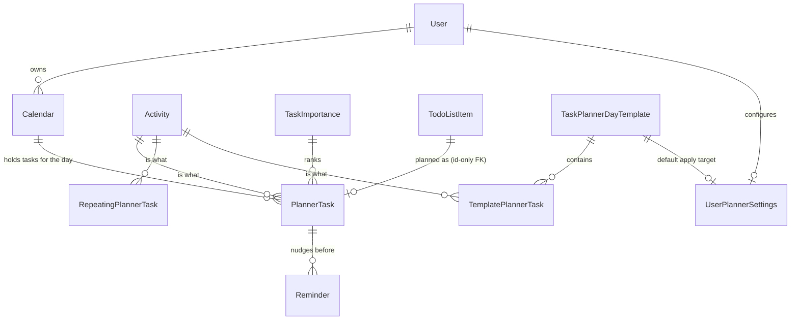

# AdhdTimeOrganizer.Planning — domain map

Navigation index for the slice. Read [`summary.md`](summary.md) first.

## Entities

`User` and `Activity` are Core's. `TodoListItem` is TodoLists' and is **not referenced by this
project** — see below.

| Type | File |
|---|---|
| `Calendar` | `domain/model/entity/Calendar.cs` |
| `BasePlannerTask` | `domain/model/entity/activityPlanning/BasePlannerTask.cs` |
| `PlannerTask` | `domain/model/entity/activityPlanning/PlannerTask.cs` |
| `RepeatingPlannerTask` | `domain/model/entity/activityPlanning/RepeatingPlannerTask.cs` |
| `TemplatePlannerTask` | `domain/model/entity/activityPlanning/TemplatePlannerTask.cs` |
| `TaskPlannerDayTemplate` | `domain/model/entity/activityPlanning/TaskPlannerDayTemplate.cs` |
| `TaskImportance` | `domain/model/entity/activityPlanning/TaskImportance.cs` |
| `UserPlannerSettings` | `domain/model/entity/activityPlanning/UserPlannerSettings.cs` |
| `Reminder` | `domain/model/entity/reminder/Reminder.cs` |
| `PlannerSuggestionFromPlannerTask` / `…FromActivityHistory` / `…FromDayTemplate` | `domain/model/entity/suggestion/` |

## The one cross-slice relationship

`PlannerTask.TodolistItemId` → `todo_list_item.id`, `ON DELETE SET NULL`, constraint name pinned to
`fk_planner_task_todo_list_items_todolist_item_id`.

**Declared in the host**, at `AdhdTimeOrganizer/infrastructure/persistence/AppDbContext.cs` →
`ConfigureCrossSliceRelationships`, because that is the only place both entity types are in scope.
There is no navigation property on either end; do not add one back.

Pinned name, verbatim from the original configuration: EF derives a relationship's constraint name
from whether the principal's `ToTable` has already run when the FK is named, so the generated name
shifts every time a new slice changes the `ApplyConfigurationsFromAssembly` order. Naming it
explicitly makes it immune.

Guarded by `PlanningRouteSmokeTests.PlannerTaskToTodoListItem_ForeignKey_SurvivesTheSliceSplit`.

## Suggestion read-models

Three keyless-ish entities mapped over materialized views. The views themselves — SQL, installer,
refresh interceptor and refresh job — are **host-side**; only the mappings live here, because the two
suggestion endpoints are their only consumers.

| Entity | View | Consumed by |
|---|---|---|
| `PlannerSuggestionFromPlannerTask` | `mv_planner_task_pattern` | `GetSuggestionsRepeatingPlannerTaskEndpoint` |
| `PlannerSuggestionFromActivityHistory` | `mv_activity_history_pattern` | `GetSuggestionsRepeatingPlannerTaskEndpoint` |
| `PlannerSuggestionFromDayTemplate` | `mv_template_suggestion_pattern` | `GetSuggestionsTaskPlannerDayTemplateEndpoint` |

The names carry both halves on purpose: `PlannerSuggestion…` is who consumes the rows (the two
planner suggestion endpoints), `…From<Source>` is which table they were aggregated from. **The class
names are decoupled from the view names** — every configuration pins its view with an explicit
`ToView(...)`, so renaming an entity never touches the schema.

`PlannerSuggestionFromActivityHistory` is why this slice does **not** depend on History: it is a view
over `activity_history`, not the `ActivityHistory` entity. The view is the seam.

## Day-plan completion streak

Derived, never stored — there is no entity, no column and no migration. The rules are one pure
function; the query that feeds it is one grouped read.

| Type | File |
|---|---|
| `PlannerStreakService` | `domain/service/PlannerStreakService.cs` — the rules (`Evaluate` one day, `Walk` the history) |
| `IPlannerStreakReader` | `domain/serviceContract/IPlannerStreakReader.cs` |
| `PlannerStreakReader` | `application/service/taskPlanner/PlannerStreakReader.cs` — the qualifying-task predicate + the day boundary |
| `PlannerStreakResponse` | `application/dto/response/taskPlanner/PlannerStreakResponse.cs` |

Delivered on `CalendarResponse.Streak`, filled in by `GetByDateCalendarEndpoint` **after** the
projection (a streak is a walk across days; `Projection` runs per row). Every other calendar read
leaves it null. See [`summary.md`](summary.md#day-plan-completion-streak) for the rules and why they
are what they are.

Guards: `Services.PlannerStreakServiceTests` (17 rule tests, no DB) and
`Endpoints.PlannerStreakTests` (8 over HTTP, including the un-tick round-trip).

## Endpoints

`application/endpoint/activityPlanning/` — `calendar/`, `plannerSettings/`, `plannerTask/`,
`repeatingPlannerTask/`, `taskImportance/`, `taskPlannerDayTemplate/`, `templatePlannerTask/`.
`application/endpoint/reminder/` — `command/{Create,Update,Delete}`, `query/{GetById,GetByDate}`.

Not here, deliberately: `SyncCalendarToGoogleEndpoint` and the rest of the Google Calendar
integration (host-side, carries `Google.Apis.Auth`), and `CalendarActivityEndpoint`.

## Reminders → the Reminders module

`ReminderRegistrationService` (`application/service/reminder/`) is the single seam between this
slice's `Reminder` rows and `framework/Sydowwe.Reminders`' scheduling registry, reached only through
`Sydowwe.Framework.Contracts` (`IReminderRegistry`, `IQuietHoursReader`, the payload records). Its
interface `IReminderRegistrationService` sits next to it in `domain/serviceContract/`.

`Reminder.RemindAt` is a **cache** of the linked task's instant, recomputed from `Calendar.Date` +
`StartTime` on every sync. The task stays authoritative — that bidirectional coupling is why
reminders are in this slice rather than a project of their own.

## Seeders (Order band 400–499)

| Seeder | Kind | Order |
|---|---|---|
| `CalendarSeeder` | per-user default (hand-rolled) | see file |
| `TaskImportanceSeeder` | per-user default | see file |
| `UserPlannerSettingsSeeder` | per-user default | see file |
| `TaskPlannerDayTemplateSeeder` | dev fixture | 400 |
| `TemplatePlannerTaskSeeder` | dev fixture | 410 |
| `PlannerTaskSeeder` | dev fixture — **host-side** | 420 |
