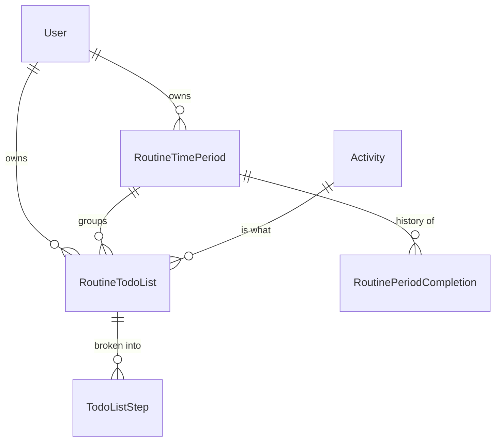

# AdhdTimeOrganizer.Routines — Domain Map

Navigation index. Open only what you need; `summary.md` is the orientation.

## Model

`User` and `Activity` are Core's; `BaseTodoListItem` and `TodoListStep` are TodoLists'. None of them
carries an inverse collection back into this slice.

Not shown, because it is **not in this project**: `PlannerTask` (Planning, still host-side) has no
navigation to `RoutineTodoList` — the completion fan-out is entirely event-based, through Core's
`RoutineTodoListIsDoneChangedEvent`.

## Entities — `domain/model/entity/todoList/`

| Type | Notes |
|---|---|
| `RoutineTimePeriod` | `BaseEntityWithUser` + `IEntityWithIsHidden` + `IBaseTextColorEntity`. `LengthInDays` / `ResetAnchorDay` drive `RoutineResetService.ComputeNextReset`. Two unique indexes: `(UserId, Text)` and `(UserId, LengthInDays)`. Carries `Streak` / `BestStreak` / `StreakGraceUntil` and the two notification idempotency marks `EndingSoonNotifiedFor` / `GraceNotifiedFor`. |
| `RoutineTodoList` | Derives from TodoLists' `BaseTodoListItem` — the one real outbound edge (see `summary.md`). Adds `TimePeriodId`, its own `Streak` / `BestStreak` / `LastCompletedAt`, and `SuggestedDays` / `SuggestedDayOfMonth`. |
| `RoutinePeriodCompletion` | Plain `BaseEntity` (no `UserId` — scoped transitively through `TimePeriodId`). One row per elapsed period: `PeriodStart` / `PeriodEnd` / `CompletedCount` / `TotalCount`. Unique on `(TimePeriodId, PeriodStart)`. |

## Domain logic — `domain/service/RoutineResetService.cs`

Static, no DI. Pure functions over the three entities:

| Method | Called from |
|---|---|
| `ComputeNextReset` | Everything below; also the `RoutineTimePeriodResponse.NextResetAt` projection. |
| `CheckGrace` | Every read/write site, before `TryReset` — breaks a lapsed streak grace window. |
| `TryReset(period, item, now)` | Single-item overload — the step-toggle endpoint. Does **not** advance `LastResetAt` or write a completion row; that only happens through the list overload. |
| `TryReset(period, items, now)` | List overload — the nightly job, the grouped read, and the bulk toggle-is-done endpoint. Advances the streak, writes `RoutinePeriodCompletion`, clears `EndingSoonNotifiedFor`. |
| `EvaluateEndingSoon` / `ShouldWarnGraceExpiring` | The nudge job only. |
| `UpdateItemStreak` | After any toggle that completes an item. |

**Known-open findings, deliberately not fixed here** (see `summary.md`): grace-expiry streak breaks
can be dropped by the reset job under some orderings; the two `TryReset` overloads disagree on streak
scoring; a failed notification can abort the nudge sweep's idempotency markers mid-sweep.

## Notifications — `application/service/routine/`, `domain/serviceContract/`

`IRoutinePeriodNotificationService` / `RoutinePeriodNotificationService` map three routine events
onto `Sydowwe.Framework.Contracts.notification` payloads (`RoutinePeriodEndedPayload`,
`RoutinePeriodEndingSoonPayload`, `RoutineStreakGraceExpiringPayload`). Every method is best-effort —
catches and logs, never throws — because a notification failure must never roll back a reset that
already committed.

## Configuration — `infrastructure/persistence/`

| File | Covers |
|---|---|
| `configuration/todoList/RoutineTimePeriodConfiguration.cs` | Seven `CHECK` constraints (anchor-day range, length range, non-negative streaks, threshold/grace/history-depth/reminder-lead ranges) plus the two unique indexes. |
| `configuration/todoList/RoutineToDoListConfiguration.cs` | `BaseTodoListConfigure()` (from TodoLists) + `IsManyWithOneUser()` / `IsManyWithOneActivity()` (from Core) + the `SuggestedDays` array conversion. |
| `configuration/todoList/RoutinePeriodCompletionConfiguration.cs` | Cascade FK to `RoutineTimePeriod`; unique on `(TimePeriodId, PeriodStart)`. |
| `extensions/RoutineTodoListExtensions.cs` | The `DbSet<RoutineTodoList>` overload of `GetNextDisplayOrder` grouped by `TimePeriodId`. The generic version stays in TodoLists' `TodoListExtensions` — naming `RoutineTodoList` there would have inverted the one-way edge. |

## HTTP surface — `application/endpoint/todoList/`

| Area | Count | Path |
|---|---|---|
| `RoutineTimePeriod` CRUD + toggle-is-hidden + select-options + completion-history | 8 | `routineTimePeriod/` |
| `RoutineTodoList` CRUD + grouped-by-period + toggle-is-done + change-display-order | 9 | `routineTodoList/command`, `routineTodoList/query` |
| `RoutineTodoList` step create/update/delete | 3 | `routineTodoList/steps/` |

`RoutineToggleIsDoneTodoListEndpoint` and `ToggleStepIsDoneRoutineTodoListEndpoint` subclass
TodoLists' `BaseToggleIsDoneTodoListEndpoint<TEntity>` / `BaseToggleStepIsDoneEndpoint<TEntity>`;
`ChangeDisplayOrderRoutineTodoListEndpoint` subclasses `BaseChangeDisplayOrderTodoListEndpoint<TEntity>`;
the three step endpoints subclass the `steps/Base*StepEndpoint<TParent>` family. All four bases live
in TodoLists — that inheritance is the `Routines → TodoLists` edge.

DTOs sit under `application/dto/` (`request/todoList`, `response/todoList`, two filters); validators
under `application/validator/` — three of them, two with a DB-backed cross-field rule
(`SuggestedDays`/`SuggestedDayOfMonth` must match the target period's `LengthInDays` bucket).

## Seeding — `infrastructure/persistence/seeder/`

Band **200–299**; the contract is `AdhdTimeOrganizer.Core/infrastructure/persistence/seeder/SeederOrderBands.md`.

- `userDefault/RoutineTimePeriodSeeder` (200) — per-user default, subclasses
  `BasePerUserDefaultSeeder<RoutineTimePeriod>`. `Collides` checks **both** unique indexes
  (`Text` and `LengthInDays`) — either one rejects a row.
- `dev/RoutineTodoListSeeder` (200) — per-user dev fixture. **Only dev seeders truncate.**

## Jobs — `infrastructure/jobs/`

Both are keyed `IScheduledJobHandler` implementations (`Sydowwe.Framework.Contracts.scheduling`), **not
Quartz `IJob`s** — this slice references no Quartz. They are picked up by the `IScopedService` marker
scan like any other service, and their schedules are pushed on boot by
`infrastructure/scheduling/RoutinesScheduledJobsRegistrar` through `IScheduler`. Both take the scoped
`DbContext` directly (the Scheduler's dispatcher opens the scope per fire) and run unauthenticated.
`DisallowConcurrent = true` is requested on the registration — it is no longer an attribute on the class.

- `RoutineTodoListResetJobHandler` (`Routines.TodoListReset`) — 02:00 daily. Sweeps every period,
  applies `TryReset`, persists completions, notifies after commit.
- `RoutinePeriodNudgeJobHandler` (`Routines.PeriodNudge`) — 09:00 daily (later than the reset,
  deliberately: this one is addressed to a person, not the database). Sequential per period — see the
  file's header comment for why `Task.WhenAll` would break the single scoped `DbContext`.

## Invariants

1. **No reference to `AdhdTimeOrganizer` (the host), and no reference to Planning.** Enforced by the
   csproj. The completion fan-out crosses that boundary only through Core's event record, consumed
   host-side.
2. **`Routines → TodoLists` is the only outbound slice edge**, and it is structural (inheritance),
   not a filter — don't try to invert it through the `IActivityMembershipSource` seam pattern; that
   pattern is for "does this activity belong to you," not for shared base types.
3. **Per-user scoping is the DbContext's job**, via the global filter on `IEntityWithUser` — not the
   endpoints (`ApplyUserScoping` is a no-op virtual). Both routine entities that carry `UserId` must
   stay `IEntityWithUser` with their FKs and cascades intact.
4. **`RoutineTodoListActivityMembershipSource` is resolved by string key.** A rename of
   `ActivityMembershipSourceKeys.RoutineTodoList` without updating both sides is silent — no build
   error, the History grid's routine filter just stops narrowing.
5. **Class names are table names.** Renaming a type here is a migration; moving it is not — this
   extraction's migration is empty, which is the proof.
