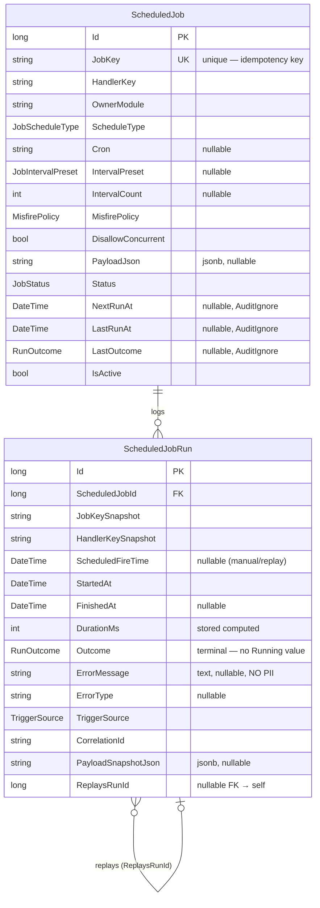

# Scheduler — Domain Map

## Model

Both entities are `BaseTableEntity` descendants (Id + timestamps + row_version, auto-audited per the interceptor). `ScheduledJobRun` is `[NoAudit]`. Neither is user-scoped.

## Invariants

- **`ScheduledJob.JobKey` is unique** — *DB-enforced* (unique index). This is the idempotency guarantee behind `IScheduler.RegisterRecurringJobAsync` (upsert by `JobKey`).
- **`ScheduledJobRun` is append-only** — *convention-enforced* (no DB trigger): one INSERT per run at completion, never updated/deleted. Corrections are new reversal/replay rows. `ReplaysRunId` (→
  self,
  `Restrict`) carries replay/correction lineage.
- **At most one *actual execution* per scheduled occurrence** — *DB-enforced* (partial unique index on
  `(ScheduledJobId, ScheduledFireTime)` `WHERE outcome IN ('Succeeded','Failed') AND scheduled_fire_time IS
  NOT NULL`). This is the durable backstop for the dispatcher's misfire/catch-up dedup; a racing concurrent fire of the same occurrence fails at the insert and is recorded as a `DuplicateFire`
  `Skipped`. `Skipped`
  rows and off-schedule (`null` `ScheduledFireTime`) manual/replay fires are deliberately outside the filter.
- **Every run row is terminal** — `RunOutcome` has no "Running"/"InProgress" value; `StartedAt`,
  `FinishedAt` and `Outcome` are written together. Hence `DurationMs` is a safe stored generated column (`(EXTRACT(EPOCH FROM (finished_at - started_at)) * 1000)::integer`).
- **A crash mid-run leaves no run row** — recovery is the next scheduled fire + the misfire policy. In-flight state lives in `ScheduledJob.Status` + the in-process concurrency gate, not a run row.
- **Schedule fields mirror `ScheduleSpec`** — `Cron` set iff `ScheduleType.Cron`; `IntervalPreset` +
  `IntervalCount` set iff `ScheduleType.Interval`. (App-enforced; not a DB check constraint.)
- **`ScheduledJobRun.ScheduledJob` is `Restrict` on delete** — never cascade-delete run history with a job (it's a ledger).
- **No FK to any domain table** — `OwnerModule` / `HandlerKey` / `JobKey` are strings; the body is an opaque `Payload`.

## The `Sydowwe.Framework.Contracts.scheduling` contract

Free of any domain type — only primitives + these DTOs. Owners depend on this, never on `Core.Scheduler`.

| Type                                                                        | Kind      | Role                                                                                                                                    |
|-----------------------------------------------------------------------------|-----------|-----------------------------------------------------------------------------------------------------------------------------------------|
| `IScheduler`                                                                | interface | Register (idempotent upsert) / remove / pause / resume / trigger-now. Impl: `infrastructure/SchedulerService.cs` (phase 02b).           |
| `IScheduledJobHandler`                                                      | interface | `Key` + `ExecuteAsync(ctx, ct)` — the owner's keyed work body. Runs with no authenticated user.                                         |
| `RecurringJobRegistration`                                                  | DTO       | Upsert payload: `JobKey`, `HandlerKey`, `OwnerModule`, `ScheduleSpec`, `MisfirePolicy`, `Payload`, `DisallowConcurrent`, `Description`. |
| `ScheduleSpec`                                                              | DTO       | `FromCron(cron)` or `Every(preset, count)`. No one-shot.                                                                                |
| `ScheduledJobContext`                                                       | DTO       | `ScheduledFireTimeUtc`, `ActualFireTimeUtc`, `JobKey`, `PayloadJson` + `GetPayload<T>()`, `CorrelationId`, `TriggerSource`.             |
| `JobScheduleType` / `JobIntervalPreset` / `MisfirePolicy` / `TriggerSource` | enums     | Contract enums (used by both the DTOs and the entities).                                                                                |

## Glossary

| Term        | Meaning                                                        | Code                                                   |
|-------------|----------------------------------------------------------------|--------------------------------------------------------|
| Job key     | Stable unique id of a recurring schedule (the idempotency key) | `ScheduledJob.JobKey`                                  |
| Handler key | Names the strategy that does the work                          | `ScheduledJob.HandlerKey` / `IScheduledJobHandler.Key` |
| Run log     | Append-only ledger of executions                               | `ScheduledJobRun`                                      |
| Misfire     | A fire missed (process down, starvation) and how to catch up   | `MisfirePolicy`                                        |
| Replay      | Re-invoke a past run from its captured payload                 | `TriggerSource.Replay` + `ReplaysRunId`                |

## Navigation index

| Name                                                                                                            | Kind          | Responsibility                                                                                                                                                                                                                                                                                                                       | Path                                                                             |
|-----------------------------------------------------------------------------------------------------------------|---------------|--------------------------------------------------------------------------------------------------------------------------------------------------------------------------------------------------------------------------------------------------------------------------------------------------------------------------------------|----------------------------------------------------------------------------------|
| ScheduledJob                                                                                                    | Entity        | Recurring-job registry (one per JobKey)                                                                                                                                                                                                                                                                                              | `domain/entity/ScheduledJob.cs`                                                  |
| ScheduledJobRun                                                                                                 | Entity        | Append-only run log                                                                                                                                                                                                                                                                                                                  | `domain/entity/ScheduledJobRun.cs`                                               |
| JobStatus / RunOutcome                                                                                          | Enum          | Stored job state / terminal run result                                                                                                                                                                                                                                                                                               | `domain/enum/`                                                                   |
| ScheduledJobEntityConfiguration                                                                                 | EF config     | Unique JobKey index, enum/jsonb columns                                                                                                                                                                                                                                                                                              | `infrastructure/persistence/configuration/ScheduledJobEntityConfiguration.cs`    |
| ScheduledJobRunEntityConfiguration                                                                              | EF config     | Computed DurationMs, dedup/failure indexes, Restrict FKs                                                                                                                                                                                                                                                                             | `infrastructure/persistence/configuration/ScheduledJobRunEntityConfiguration.cs` |
| ScheduledJobDto                                                                                                 | DTO           | Registry projection (SQL-translatable)                                                                                                                                                                                                                                                                                               | `application/dto/scheduledJob/ScheduledJobDto.cs`                                |
| ScheduledJobRunDto                                                                                              | DTO           | Run-log projection                                                                                                                                                                                                                                                                                                                   | `application/dto/scheduledJobRun/ScheduledJobRunDto.cs`                          |
| SchedulerQuartzConfig                                                                                           | Quartz config | Centralised AddQuartz defaults + durable dispatcher registration + hosted-service options (02a)                                                                                                                                                                                                                                      | `infrastructure/SchedulerQuartzConfig.cs`                                        |
| ScheduledJobDispatcher                                                                                          | Quartz job    | The single generic dispatcher every trigger points at: keyed-handler invocation + failure isolation + per-key concurrency + misfire/catch-up dedup + append-only run-log capture (03)                                                                                                                                                | `application/job/ScheduledJobDispatcher.cs`                                      |
| JobConcurrencyGate                                                                                              | Service       | Singleton per-`JobKey` in-process gate — authoritative `DisallowConcurrent` enforcement single-node (03)                                                                                                                                                                                                                             | `infrastructure/JobConcurrencyGate.cs`                                           |
| SchedulerService                                                                                                | Service       | `IScheduler` impl: idempotent upsert / remove / pause / resume / trigger-now + schedule→trigger translation (02b)                                                                                                                                                                                                                    | `infrastructure/SchedulerService.cs`                                             |
| RegisterJobRequest / JobKeyRequest / ScheduledJobFilterRequest                                                  | DTO           | Request DTOs for the admin control + grid endpoints                                                                                                                                                                                                                                                                                  | `application/dto/scheduledJob/`                                                  |
| ScheduledJob endpoints                                                                                          | FastEndpoints | Admin-only control (`register`/`remove`/`pause`/`resume`/`trigger-now`) + reads (`{id}`, `filtered-table`) under `/api/scheduled-job`                                                                                                                                                                                                | `application/endpoint/scheduledJob/`                                             |
| Dashboard endpoints                                                                                             | FastEndpoints | Admin-only reads under `/api/scheduler-dashboard`: `jobs-overview` + `run-history` grids, `run/{id}` detail, `health`, and the two `*/export` variants (04a)                                                                                                                                                                         | `application/endpoint/dashboard/read/`                                           |
| ReplayJobRunEndpoint                                                                                            | FastEndpoints | Admin-only `POST run/{id}/replay` — re-run a past run through the dispatcher (new linked Replay row); thin wrapper over `IScheduledRunReplayer` (04b)                                                                                                                                                                                | `application/endpoint/dashboard/command/ReplayJobRunEndpoint.cs`                 |
| IScheduledRunReplayer / ScheduledRunReplayer                                                                    | Service       | Module-internal (NOT on the `Sydowwe.Framework.Contracts` surface): loads a past run, validates it + its handler, fires the dispatcher with a `TriggerSource = Replay` snapshot data map; writes no run row itself (04b)                                                                                                                                   | `domain/serviceContract/` + `infrastructure/ScheduledRunReplayer.cs`             |
| ScheduledJobsOverviewQuery / JobRunHistoryQuery                                                                 | Query helper  | Shared filter + default sort for each dashboard surface, so grid and export can't drift (04a)                                                                                                                                                                                                                                        | `application/dashboard/`                                                         |
| OverduePolicy                                                                                                   | Policy        | The module's ONE stuck/overdue predicate, shared by the overview filter + health (04a) and the overdue sweep (08). Default `GraceMargin = 60s` (== Quartz default misfire threshold); margin is a parameter, and `WhereNotInFlight` composes the alert-path-only exclusion of jobs currently executing (`ScheduledJob.RunningSince`) | `application/dashboard/OverduePolicy.cs`                                         |
| OverdueJobSweepJobHandler / OverdueJobSweepOptions                                                              | Job handler   | Scheduler-owned recurring sweep (08): alerts on `Active` jobs that never fired, via the same `IJobFailureNotifier` seam. Closes the "never fires" gap 05's alerting can't reach                                                                                                                                                      | `application/job/`                                                               |
| ScheduledJobsOverviewFilterRequest / JobRunHistoryFilterRequest / ScheduledJobRunDetailDto / SchedulerHealthDto | DTO           | Dashboard request/response DTOs (04a)                                                                                                                                                                                                                                                                                                | `application/dto/`                                                               |
| ISchedulerExportService / SchedulerExportService                                                                | Service       | XLSX/CSV export of the dashboard projections (Syncfusion + CSV), mirroring AttendanceExportService; never exports the run payload (04a)                                                                                                                                                                                              | `domain/serviceContract/` + `application/service/`                               |
| (contract)                                                                                                      | Contracts     | `Sydowwe.Framework.Contracts.scheduling` — see table above                                                                                                                                                                                                                                                                                                | `Sydowwe.Framework.Contracts/scheduling/`                                          |

## Out of scope (later phases)

Migrating the existing per-module jobs (05) — **in progress**; recipe + per-module tracker live in
`summary.md` (§ "Migrating existing jobs onto the substrate"). The job *bodies* stay in their owning module as `IScheduledJobHandler`s; only the wiring centralises here. (Operator controls +
run-history replay: **done in 04b**. The controls
[trigger-now / pause / resume] reuse the 02b `/api/scheduled-job` endpoints unchanged — no duplicate impl; 04b adds only `ReplayJobRunEndpoint` + `IScheduledRunReplayer`, which reuse the phase-03
dispatcher as the one execution path. **No dashboard frontend prompt or `.vue` views exist yet** —
`frontend-prompts/scheduler-dashboard.md` was referenced here but never written; the UI is unbuilt.)
(Dashboard reads + exports — jobs overview, run history, run detail, health, `Export*`: **done in 04a**. The run log is the source of truth for the health view; the overdue grace margin == the Quartz
default misfire threshold.)
(Centralised `AddQuartz` config + durable dispatcher stub: **done in 02a**. `IScheduler` impl +
`ScheduleSpec`→trigger translation + admin endpoints + the startup-reconciliation contract: **done in 02b**. Dispatcher **body** — keyed-handler invocation + failure isolation + per-key concurrency
(`DisallowConcurrent`) + misfire/catch-up dedup + append-only run-log capture: **done in 03**. The
`JobDataMap` keys `PayloadOverrideDataKey`/`ReplaysRunIdDataKey` are read by the dispatcher now so 04b replay reuses the single execution path.)