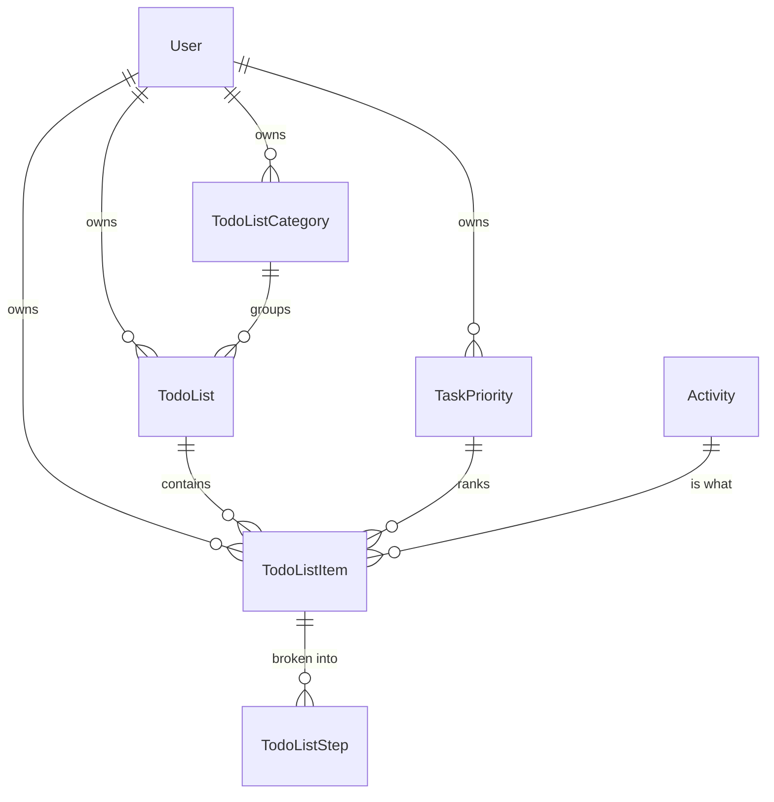

# AdhdTimeOrganizer.TodoLists — Domain Map

Navigation index. Open only what you need; `summary.md` is the orientation.

## Model

`User` and `Activity` are Core's. Neither carries an inverse collection back into this slice — that
is what keeps Core free of a reference to it.

Not shown, because they are **not in this project**: `RoutineTodoList` and `RoutinePeriodCompletion`
also derive from `BaseTodoListItem` / hang off `RoutineTimePeriod`, but they stay host-side until the
Routines slice. `PlannerTask` points at `TodoListItem` from the Planning side only.

## Entities — `domain/model/entity/todoList/`

| Type | Notes |
|---|---|
| `BaseTodoListItem` | The shared base: `DisplayOrder`, `IsDone`, `DoneCount` / `TotalCount`, the `TodoListStep` collection. **Routines derives from this**, which is why it lives here and not in Core. `SetDone` only rewrites `DoneCount` when `TotalCount.HasValue` — deliberate. |
| `TodoList` | Grouped by an optional `TodoListCategory`. |
| `TodoListItem` | `BaseTodoListItem` + `TodoListId`, `TaskPriorityId`, `ActivityId`, `DueDate` / `DueTime`, `PairedLeisureActivityId`, `CompletedTimestamp`. **No `PlannerTask` navigation** — the relationship is owned from Planning. `CompletedTimestamp` is written **only** by `TodoListItemCompletionInterceptor`, never by hand. |
| `TodoListCategory` | Per-user lookup. |
| `TodoListStep` | The sub-items of any `BaseTodoListItem`. |
| `TaskPriority` | Per-user lookup; unique key is `(user_id, priority)`, **not** `Text`. Matters when writing `Collides` in its seeder. |

## Configuration — `infrastructure/persistence/`

| File | Covers |
|---|---|
| `configuration/todoList/TodoListConfiguration.cs` | |
| `configuration/todoList/ToDoListItemConfiguration.cs` | Note the `ToDoList` spelling in the file name; the class is `TodoListItem`. |
| `configuration/todoList/TodoListCategoryConfiguration.cs` | |
| `configuration/todoList/TaskPriorityConfiguration.cs` | Moved here from `configuration/activityPlanning/` — the folder was lying about which domain owns it. |
| `configuration/extensions/TodoListEntityConfigurationExtensions.cs` | `BaseTodoListConfigure<TEntity>()`, applied by the routine configurations too. |
| `extensions/TodoListExtensions.cs` | `GetNextDisplayOrder<TEntity>` (generic), `GetNextDisplayOrder(DbSet<TodoListItem>, …)`, `GetDisplayOrderById`, `GetGroupIdById`. The `DbSet<RoutineTodoList>` overload is **not** here — see `summary.md`. |
| `settings/TodoListSettings.cs` | `DisplayOrderStart` / `DisplayOrderGap`. Bound in `Program.cs`; consumed by the reorder endpoints and both seeders. |
| `interceptor/TodoListItemCompletionInterceptor.cs` | The sole writer of `TodoListItem.CompletedTimestamp`. Registered host-side in `Program.cs`'s `AddInterceptors` call — the class lives here because it names `TodoListItem`, but nothing in this slice wires it up. Fires only on a genuine `IsDone` transition; `ExecuteUpdateAsync` bypasses it. |

Everything general (`BaseEntityConfigure`, `EnumColumn`, …) comes from `Sydowwe.Framework`; the
`IsManyWithOneUser` / `IsManyWithOneActivity` helpers come from Core.

## HTTP surface — `application/endpoint/todoList/`

| Area | Count | Path |
|---|---|---|
| Shared bases: toggle-is-done, toggle-step-is-done, change-display-order | 3 | `*.cs` at the folder root |
| Shared step bases: create / update / delete | 3 | `steps/` |
| `TodoList` | 6 | `todoList/` |
| `TodoListItem` | 15 | `todoListItem/` |
| `TodoListCategory` | 6 | `todoListCategory/` |
| `TaskPriority` | 7 | `taskPriority/` |

The six bases are **referenced from Routines**, which subclasses them for `RoutineTodoList`. That is
the only reason a base sits in a slice rather than in Framework: it is typed on `BaseTodoListItem`.

DTOs sit under `application/dto/` (`request/todoList`, `response/todoList`, and three filters);
validators under `application/validator/` — 10 of them. The routine-shaped DTOs and validators stayed
host-side with the routine endpoints.

## Seeding — `infrastructure/persistence/seeder/`

Band **100–199**; the contract is `AdhdTimeOrganizer.Core/infrastructure/persistence/seeder/SeederOrderBands.md`.

- `userDefault/TaskPrioritySeeder` (100) — per-user default, subclasses `BasePerUserDefaultSeeder<TaskPriority>`.
  Its `Collides` keys on `(user_id, priority)`, not `Text`.
- `dev/TodoListSeeder` (100) — per-user dev fixture. **Only dev seeders truncate.**

## Invariants

1. **No reference to `AdhdTimeOrganizer`, and none to another slice.** Enforced by the csproj having
   neither. Wanting `AppDbContext` means wanting `DbContext`.
2. **Per-user scoping is the DbContext's job**, via the global filter on `IEntityWithUser` — not the
   endpoints (`ApplyUserScoping` is a no-op virtual). These entities must stay `IEntityWithUser` and
   keep their FKs and cascades.
3. **The shared bases stay in this project.** Routines depends on them from here; moving them to
   Core would grow the thing that is supposed to shrink.
4. **Nothing here may name a Routines or Planning type.** Both edges point inward, not out. The same
   goes for History: the daily recap reads logged time through Core's `ITodoListItemLoggedTimeSource`
   rather than touching `ActivityHistory`.
5. **`CompletedTimestamp` is stamped from the ChangeTracker, not at the call sites.** There are five
   places that write `IsDone` and a sixth is always one feature away; a site that forgot to stamp
   would break nothing visible, the item would just never appear in a daily recap.
   `TodoListItemCompletionInterceptor` owns it, registered host-side in `Program.cs`. Anything that
   bypasses the ChangeTracker — `ExecuteUpdateAsync` in particular — bypasses the stamp too.
6. **Class names are table names.** Renaming a type here is a migration; moving it is not — but see
   the pinned FK constraint name in `summary.md` for the one case where *ordering* changed a name.
