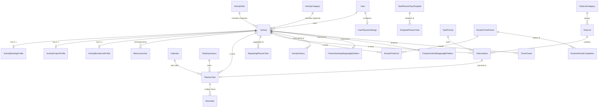

# AdhdTimeOrganizer (Portal) — Domain Map

## Model

`Activity` is the hub. Everything the user schedules, ticks off, tracks or times points at one.

Three read-only pattern sources back the suggestion engine (materialized views, not tables):
`PlannerSuggestionFromPlannerTask` (`mv_planner_task_pattern`), `PlannerSuggestionFromActivityHistory`
(`mv_activity_history_pattern`), `PlannerSuggestionFromDayTemplate`
(`mv_template_suggestion_pattern`) — all three entities live in `AdhdTimeOrganizer.Planning`.

Tracking ingests raw, unmapped rows — `DesktopActivityEntry`, `WebExtensionActivityEntry`,
`AndroidSessionData` — which the `Tracker*MappingByPattern` rules attribute to an Activity / Role /
Category (or mark ignored) at read time.

## Invariants

DB-enforced unless stated otherwise.

**Ownership**
- Every `IEntityWithUser` row has a NOT NULL `UserId` (via `IsManyWithOneUser` / `IsOneWithOneUser`).
- Reads are scoped to the logged-in user by a global query filter, *not* by endpoints — see
  `summary.md`. The three `Activity*Profile` entities are **not** `IEntityWithUser` and have **no
  filter**; they are reachable only through their `Activity`, and their grids scope by hand.

**Uniqueness (all per user)**
- `Activity(UserId, Name)`, `ActivityRole(UserId, Name)`, `ActivityCategory(UserId, Name)`,
  `TodoList(UserId, Name)`, `TodoListCategory(UserId, Name)`, `RoutineTimePeriod(UserId, Text)`.
- `Calendar(UserId, Date)` — one calendar row per user per day.
- `TaskImportance(UserId, Importance)` and `TaskPriority(UserId, Priority)` — rank values are unique,
  so reordering is a swap, not an insert.
- `RoutineTimePeriod(UserId, LengthInDays)` — **a user may have only one period of each length.**
- `RoutineTodoList(UserId, TimePeriodId, ActivityId)` and `TodoListItem(UserId, ActivityId, TodoListId)`
  — the same activity cannot be listed twice in the same list/period.
- `ActivityHistory(UserId, ActivityId, StartTimestamp)`; `RoutinePeriodCompletion(TimePeriodId, PeriodStart)`.
- Each `Activity*Profile.ActivityId` is unique — 0..1 profile of each kind per activity.
- Tracking ingest is idempotent by unique key: `DesktopActivityEntry(UserId, WindowStart, RecordDate,
  ProcessName, WindowTitle)`, `WebExtensionActivityEntry(UserId, WindowStart, Domain, RecordDate)`,
  `AndroidSessionData(UserId, DeviceId, PackageName, SessionStartUtc)`.

**Ranges / shape**
- `RoutineTimePeriod`: `LengthInDays` 1–365; `StreakThreshold` 1–100 (percent); `StreakGraceDays`
  0..`LengthInDays - 1`; `HistoryDepth` 1–100; `ReminderLeadDays` NULL or 1..`LengthInDays - 1`
  (so a one-day period can never have a lead nudge); `ResetAnchorDay` 1–7 when the period is
  weekly-aligned (`≤ 7` or a multiple of 7), otherwise 1–30.
- `BaseTodoListItem`: `DoneCount >= 0`, `TotalCount` between 2 and 99, `DoneCount <= TotalCount`.
- `MemoryAnchor`: `AnchorMonth` 1–12, `Rating` 1–10.
- `Tracker*MappingByPattern`: check constraints require a coherent pattern/target combination, and the
  pattern tuple is unique per user.

**Delete behaviour** — deliberately mixed:
- `Restrict`: `RoutineTimePeriod` → `RoutineTodoList`, `TaskPriority` → `TodoListItem`,
  `Activity` → `PlannerTask`. A lookup still in use cannot be deleted.
- `SetNull`: `TaskImportance` → planner tasks, `TodoListItem` → `PlannerTask.TodolistItemId`,
  `TodoListCategory` → `TodoList`, `UserPlannerSettings.DefaultApplyTemplateId`.
- `Cascade`: `Calendar` → `PlannerTask`, `PlannerTask` → `Reminder`, template → template tasks,
  `Activity` → its profiles, and the three Notifications tables → `User`.

**App-enforced only (no DB constraint)**
- Planner tasks may overlap; overlap is a *resolution strategy* at template-apply time, not a rule.
- `Reminder.LeadOffsetsMinutes` must be `<= 0` and unique — enforced by `ReminderValidator` and again
  by the module registry, never by the column.
- A **recurring** reminder carries exactly one lead offset (the Contracts recurring schedule has no
  lead concept; the offset is folded into the anchor).
- `Reminder.RemindAt` for a task-linked reminder is a *cache* of the task's instant; the task is
  authoritative and the value is rewritten on every sync.
- The suggestion pattern views must exist before any save touching `PlannerTask` / `ActivityHistory` /
  `Calendar`; nothing in the schema expresses that.
- `User.GoogleCalendarRefreshToken` is at-rest encrypted (AES-256-GCM via `EncryptedColumnNullable`,
  `FIELD_ENCRYPTION_KEY`); non-filterable/non-sortable as a result, but it's read only by user id, so
  that costs nothing. `GoogleOAuthUserId` stays plaintext (lower-sensitivity). Both carry
  `[AuditIgnore]`. Existing rows stay plaintext until their next write — no backfill pass has run.

## Business rules / domain logic

There is no external legal spec here — the rules are product decisions. (`docs/routineLawCheckups.md`
at the repo root is a foreign copy and does not describe this app.)

**Day planning**
- A day is a `Calendar` row (one per user per date) carrying day type, wake/bed times, optional
  location/weather/notes, and its planner tasks. Days exist only once planned — which is why
  `Reminder` anchors on an absolute instant rather than a `CalendarId`.
- `PlannerTask.IsDone` is derived (`Status == Completed`); status is the stored truth.
  `IsOptional` is `Importance.Importance == 666` — a sentinel rank, not a flag.
- **Applying a template** (`ApplyTemplatePlannerTaskEndpoint`) stamps the template onto the calendar
  (name, id, default wake/bed times), bumps `UsageCount` / `LastUsedAt`, and resolves overlaps by
  `ApplyTemplateConflictResolutionEnum`: `Ignore` (drop conflicting new tasks), `Overwrite` (delete
  conflicting existing ones), `MergeIgnore` (carve the *new* tasks around existing ones),
  `MergeOverwrite` (carve the *existing* tasks around new ones). Carving splits a task around each
  blocker and can produce several segments from one task. Reminders orphaned by any deletion are
  collected from the ChangeTracker *before* the save and cancelled after it.

**Suggestions** (`GetSuggestionsRepeatingPlannerTaskEndpoint`) — three tiers, de-duplicated in order:
1. `RepeatingPlannerTask` the user set themselves (`SourceType = UserSet`), matched by
   `RecurrenceType`: day-of-week, day-of-month, an active date range, or day type.
2. Planner patterns from `mv_planner_task_pattern` (`PlannedPattern`) — skipped for activities tier 1
   already covered.
3. History patterns from `mv_activity_history_pattern` (`HistoryPattern`) — skipped for anything
   already covered by tier 1 or by the same (activity, pattern type, value) in tier 2.

A pattern exists only at **≥ 3 occurrences** of the same (activity, ISO day-of-week *or* day-of-month),
excluding cancelled tasks (`status != 4`), and reports average start/end times. Both `pattern_type`
values are the `RecurrenceType` enum's ints (0 = DayOfWeek, 1 = DayOfMonth).

**Routines**
- A `RoutineTimePeriod` is a repeating window ("weekly chores"). `ComputeNextReset` derives the next
  reset from `LastResetAt + LengthInDays`, then snaps it to `ResetAnchorDay`: a weekday for
  weekly-aligned periods, a day-of-month otherwise, with calendar-month (30d) and calendar-year (365d)
  special cases. `ResetAnchorDay == 0` means no snapping.
- At reset (`RoutineTodoListResetJob`, 02:00 daily) the period's completion percentage is compared to
  `StreakThreshold`: at or above → streak++ (and `BestStreak` if higher), grace cleared, outcome
  `Extended`. Below, with `StreakGraceDays > 0` → `StreakGraceUntil = nextReset + graceDays`, outcome
  `OnGrace`. Below with no grace → streak zeroed, outcome `Broken`. **An empty period is
  `NotEvaluated`** and leaves the streak alone. Then all items and their steps are unticked, a
  `RoutinePeriodCompletion` row is written, and the summary notification is sent **after** the commit.
- `CheckGrace` zeroes the streak once `StreakGraceUntil` has passed; it is meant to be called before
  any reset evaluation.
- Only the list-based `RoutineResetService.TryReset` overload (used by `RoutineTodoListResetJob`,
  `GetAllGroupedRoutineTodoListEndpoint`, `RoutineToggleIsDoneTodoListEndpoint`) may advance
  `period.LastResetAt` / evaluate the streak / write a `RoutinePeriodCompletion` row. The single-item
  overload used by `ToggleStepIsDoneRoutineTodoListEndpoint` only un-ticks the touched item for a
  fresh-looking UI — it never advances the period, so a step toggle can no longer consume a due reset
  cycle.
- The 09:00 sweep (`RoutinePeriodNudgeJob`) sends two things: the lead-time nudge
  (`ReminderLeadDays` before the reset, only while something is still unfinished, ceiling days-left)
  and the grace-expiry warning (1 day before `StreakGraceUntil`). Both are marked idempotently
  (`EndingSoonNotifiedFor` / `GraceNotifiedFor`), and **a period that is fully done is skipped without
  marking**, so un-ticking an item tomorrow still earns its nudge. Hidden periods are skipped.
- Why a sweep and not a registered reminder: the message body is "3 of 8 done", and a reminder payload
  is frozen at registration time.

**Completion fan-out** — ticking one thing updates its counterparts, via FastEndpoints events:
- Planner task done/undone → the matching `RoutineTodoList` (same activity+user) and the linked
  `TodoListItem` are synced: `DoneCount` is snapped to `TotalCount` / 0 for step-counted items, and
  every `Steps[].IsDone` is snapped to match.
- To-do item done/undone → **today's** planner tasks linked to that item flip between `Completed` and
  `NotStarted` via `PlannerTask.ApplyStatus` (clearing actual start/end times for `NotStarted`, same as
  a direct `PatchPlannerTaskStatusEndpoint` call), their reminders are synced, and any task already
  `Cancelled` that day is left untouched rather than overwritten.

**Reminders** (`ReminderRegistrationService`) — the portal owns user intent (title, when, what it is
attached to); the Reminders module owns status, next occurrence and dispatch history. One registry
`Kind` (`PersonalReminder`) for standalone and task-linked alike, keyed
`("Portal", "Reminder", <id>, "PersonalReminder")`, recipients always explicit (never a resolver).
Completing or cancelling a task **retires** its reminder. A DST-gap start time is pushed forward
rather than rejected. When the request omits lead offsets on a *task-linked* reminder, the user's
`UserPlannerSettings.ReminderMinutesBefore` supplies `[-N]`.

**Time tracking** — desktop/extension/Android clients POST heartbeats of 1-minute-aligned windows;
the unique keys above make re-posting idempotent. Attribution to an Activity/Role/Category happens
through `Tracker*MappingByPattern` rules (`PatternMatchType` per field, `IsIgnored` to drop noise),
and the dashboards (pie / stacked bars / timeline / summary cards) read raw entries plus mappings.
`ActivityHistory` is the *manual* record of time spent and is separate from tracking ingest.
`DesktopActivityEntry` and `WebExtensionActivityEntry` rows are hard-deleted after **3 years** by the
daily `PurgeExpiredActivityTrackingEntriesJob` (`ActivityTrackingRetentionOptions`, no keep-last-N
floor) — there is no equivalent purge for `ActivityHistory`, which is user-authored data rather than
raw ingest.

**Account data** — `GET /user/data-export` returns a JSON dump of the user's own rows, throttled to
one request per minute via `IDistributedCache`. Account deletion fans out over `ISubjectDataEraser`
inside `UserManager.DeleteAsync`'s transaction, because most module tables are deliberately FK-free.

## Glossary

| Term | Meaning | Code |
|---|---|---|
| Activity | A named thing the user does — the domain's hub noun | `Activity` |
| Role | Life area an activity belongs to (Work, Health…), required, supplies the display colour | `ActivityRole` |
| Category | Optional second axis of classification | `ActivityCategory` |
| Calendar (day) | One planned day for one user | `Calendar` |
| Planner task | An activity scheduled into a time span on a day | `PlannerTask` |
| Day template | Reusable blueprint of a day ("Office", "Weekend") | `TaskPlannerDayTemplate` + `TemplatePlannerTask` |
| Repeating task | A user-set recurring *suggestion*, not a scheduled row | `RepeatingPlannerTask` |
| Importance / Priority | Per-user rank scales — planner side / to-do side | `TaskImportance` / `TaskPriority` |
| Optional task | Importance rank 666 — a sentinel, not a flag | `BasePlannerTask.IsOptional` |
| Routine period | Repeating window that resets its items and scores a streak | `RoutineTimePeriod` |
| Routine item | A to-do that lives inside a routine period | `RoutineTodoList` |
| Grace | Extra days a missed period gets before the streak breaks | `StreakGraceDays` / `StreakGraceUntil` |
| Step | A checklist sub-item on a to-do/routine item (owned JSON, `Guid` id) | `TodoListStep` |
| Memory anchor | A month/year highlight note + 1–10 rating for an activity | `MemoryAnchor` |
| Profile | Optional extra facts about an activity (backlog / project / bucket-list) | `Activity*Profile` |
| Pattern | A ≥3-occurrence regularity mined from planner or history rows | `mv_*_pattern` views |
| Heartbeat | A tracking client's periodic report of a 1-minute window | `*HeartbeatEndpoint` |
| Mapping | Rule attributing a tracked process/domain/app to an activity | `Tracker*MappingByPattern` |
| Reminder | The user's own nudge; scheduler state lives in the Reminders module | `Reminder` |

## Navigation index

Endpoints follow the `<Verb><Entity>Endpoint` convention and live under
`application/endpoint/<area>/<entity>/{command|query}/`. The plain CRUD sets (Create / Update /
Delete / BatchDelete / GetById / GetAll / GetSelectOptions / Grid) are not listed row by row — they
are thin subclasses of the Framework bases. Listed below are the areas, and every endpoint that does
something the base classes do not.

**Endpoint areas** (`application/endpoint/`)

| Area | Entities covered | Path |
|---|---|---|
| Activity | `Activity`, `ActivityRole`, `ActivityCategory`, four lookups, memory anchors, three profiles | `activity/` |
| Activity history | Manual time records + the history dashboards | `activityHistory/` |
| Activity planning | Calendar, planner tasks, repeating tasks, day templates, template tasks, importance, planner settings | `activityPlanning/` |
| Activity tracking | Desktop / web-extension / Android ingest, mappings, dashboards | `activityTracking/` |
| To-do lists | Lists, categories, items, steps, priorities, routine periods, routine lists | `todoList/` |
| Reminders | Portal reminder CRUD + day view | `reminder/` |
| Timers | `TimerPreset`, `PomodoroTimerPreset` | `timer/` |
| User | Auth, 2FA, sessions, settings, Google Calendar, data export | `user/` |

**Notable endpoints**

| Name | Kind | Responsibility | Path |
|---|---|---|---|
| ApplyTemplatePlannerTaskEndpoint | Endpoint | Apply a day template to a calendar; four overlap-resolution modes; cancels orphaned reminders | `application/endpoint/activityPlanning/plannerTask/command/ApplyTemplatePlannerTaskEndpoint.cs` |
| GetSuggestionsRepeatingPlannerTaskEndpoint | Endpoint | Three-tier suggestions (user-set → planner pattern → history pattern) for a calendar day | `application/endpoint/activityPlanning/repeatingPlannerTask/query/GetSuggestionsRepeatingPlannerTaskEndpoint.cs` |
| GetSuggestionsTaskPlannerDayTemplateEndpoint | Endpoint | Template suggestions from `mv_template_suggestion_pattern` | `application/endpoint/activityPlanning/taskPlannerDayTemplate/query/GetSuggestionsTaskPlannerDayTemplateEndpoint.cs` |
| PatchPlannerTaskSpanEndpoint / …StatusEndpoint | Endpoint | Drag-resize a task span; set status (drives the IsDone fan-out and reminder retirement) | `application/endpoint/activityPlanning/plannerTask/command/` |
| SyncCalendarToGoogleEndpoint | Endpoint | Push a day's tasks to Google Calendar | `application/endpoint/activityPlanning/calendar/command/SyncCalendarToGoogleEndpoint.cs` |
| GetByDateCalendarEndpoint | Endpoint | The day view — the SPA's main read | `application/endpoint/activityPlanning/calendar/GetByDateCalendarEndpoint.cs` |
| DesktopActivityHeartbeatEndpoint | Endpoint | Desktop tracker ingest (idempotent upsert by window key) | `application/endpoint/activityTracking/desktop/command/DesktopActivityHeartbeatEndpoint.cs` |
| WebExtensionDataHeartbeatEndpoint | Endpoint | Chrome-extension ingest; extension-client policy applies | `application/endpoint/activityTracking/webExtension/command/WebExtensionDataHeartbeatEndpoint.cs` |
| AndroidSyncEndpoint | Endpoint | Bulk Android session upload | `application/endpoint/activityTracking/android/command/AndroidSyncEndpoint.cs` |
| Desktop/Web/Android dashboards | Endpoints | Pie chart, stacked bars, timeline, summary cards, process/domain details | `application/endpoint/activityTracking/*/query/` |
| History dashboards | Endpoints | Summary + detail pie/bars/cards, activity calendar heat view | `application/endpoint/activityHistory/activityHistory/query/dashboard/` |
| BaseToggleIsDoneTodoListEndpoint | Endpoint base | Shared tick/untick logic for both to-do flavours; raises the IsDone events | `application/endpoint/todoList/BaseToggleIsDoneTodoListEndpoint.cs` |
| BaseChangeDisplayOrderTodoListEndpoint | Endpoint base | Reordering shared by items and routine items | `application/endpoint/todoList/BaseChangeDisplayOrderTodoListEndpoint.cs` |
| BaseCreate/Update/DeleteStepEndpoint | Endpoint bases | Checklist-step CRUD shared by both flavours | `application/endpoint/todoList/steps/` |
| GetCompletionHistoryRoutineTimePeriodEndpoint | Endpoint | The period's `RoutinePeriodCompletion` history (bounded by `HistoryDepth`) | `application/endpoint/todoList/routineTimePeriod/query/GetCompletionHistoryRoutineTimePeriodEndpoint.cs` |
| GetAllGroupedRoutineTodoListEndpoint | Endpoint | Routine items grouped by period, for the routines screen | `application/endpoint/todoList/routineTodoList/query/GetAllGroupedRoutineTodoListEndpoint.cs` |
| GetDashboardTodoListItemEndpoint | Endpoint | Cross-list to-do dashboard | `application/endpoint/todoList/todoListItem/query/GetDashboardTodoListItemEndpoint.cs` |
| MoveTodoListItemEndpoint / ChangePriorityTodoListItemEndpoint | Endpoints | Move an item between lists; change its priority rank | `application/endpoint/todoList/todoListItem/command/` |
| CloneActivityEndpoint / QuickEditActivityEndpoint | Endpoints | Shallow-clone an activity; inline edit from the planner | `application/endpoint/activity/activity/command/` |
| GetUserDataExportEndpoint | Endpoint | GDPR-style JSON export, 1/min throttle via `IDistributedCache` | `application/endpoint/user/read/GetUserDataExportEndpoint.cs` |
| DeleteUserAccountEndpoint | Endpoint | Account deletion + `ISubjectDataEraser` fan-out in the same transaction | `application/endpoint/user/command/settings/DeleteUserAccountEndpoint.cs` |
| GoogleSignInEndpoint | Endpoint | Federated sign-up/sign-in through `UserRegistrationFlow` | `application/endpoint/user/command/auth/GoogleSignInEndpoint.cs` |
| Google Calendar endpoints | Endpoints | Auth URL, connect, disconnect, status | `application/endpoint/user/command/googleCalendar/` |
| ErrorLoggingPostProcessor | Post-processor | Global endpoint error logging (registered as `IGlobalPostProcessor`) | `application/endpoint/base/ErrorLoggingPostProcessor.cs` |
| BaseActivityFormSelectOptionsEndpoint | Endpoint base | Shared activity-form option payload | `application/endpoint/base/read/BaseActivityFormSelectOptionsEndpoint.cs` |

**Services, jobs and infrastructure**

| Name | Kind | Responsibility | Path |
|---|---|---|---|
| RoutineResetService | Domain service (static) | Reset instants, streak evaluation, nudge/grace predicates — the routine rulebook | `domain/service/RoutineResetService.cs` |
| RoutinePeriodNotificationService | Service | Maps routine events onto Contracts notification payloads; best-effort, id-only logging | `application/service/routine/RoutinePeriodNotificationService.cs` |
| ReminderRegistrationService | Service | The only class that knows the Reminders module's key/schedule/payload shape | `application/service/reminder/ReminderRegistrationService.cs` |
| UserDefaultsService | Service | `IUserDefaultsService` — runs per-user default seeders at sign-up | `application/service/UserDefaultsService.cs` |
| TaskPlannerHelper | Helper | `WithIncludes()` for planner reads; `TasksOverlap` | `application/helper/TaskPlannerHelper.cs` |
| RoutineTodoListResetJobHandler | Scheduled job handler | 02:00 daily period reset + completion history + summary notification | `AdhdTimeOrganizer.Routines/infrastructure/jobs/RoutineTodoListResetJobHandler.cs` |
| RoutinePeriodNudgeJobHandler | Scheduled job handler | 09:00 daily lead-time nudge + grace-expiry warning sweep | `AdhdTimeOrganizer.Routines/infrastructure/jobs/RoutinePeriodNudgeJobHandler.cs` |
| AppDbContext | DbContext | Portal + module DbSets, identity mapping, the `WebExtensionActivityEntry` combined filter | `infrastructure/persistence/AppDbContext.cs` |
| SuggestionPatternRefreshInterceptor | Interceptor | Marks the matching pattern view dirty after saves touching planner/history/calendar (does not refresh itself) | `infrastructure/persistence/interceptors/SuggestionPatternRefreshInterceptor.cs` |
| SuggestionPatternRefreshJobHandler | Scheduled job handler | Drains the dirty-view queue every 10s and REFRESHes the pattern views off the request thread; scheduled by `PortalScheduledJobsRegistrar` | `infrastructure/jobs/SuggestionPatternRefreshJobHandler.cs` |
| PortalScheduledJobsRegistrar | Hosted service | Pushes the portal's own recurring-job registrations to the Scheduler on every boot | `infrastructure/scheduling/PortalScheduledJobsRegistrar.cs` |
| SuggestionPatternViewInstaller | Installer | Creates missing pattern views at boot from embedded SQL | `infrastructure/persistence/SuggestionPatternViewInstaller.cs` |
| SeedUserIdProvider | Service | `ISeedUserProvider` — how Framework seeders find users | `infrastructure/persistence/seeder/SeedUserIdProvider.cs` |
| PerUserDefaultMatcher | Helper | Shared matching for per-user default seeders | `infrastructure/persistence/seeder/userDefault/PerUserDefaultMatcher.cs` |
| GoogleSignInService / GoogleCalendarService | External services | Google OAuth identity; calendar push | `infrastructure/extService/` |
| ExtensionRoleClaimsProvider | Claims provider | Grants the `ActivityTracking` role to extension tokens | `infrastructure/extService/user/auth/ExtensionRoleClaimsProvider.cs` |
| PortalAuthorizationPolicies | Security | The `ActivityTracking` policy gating tracking endpoints | `infrastructure/security/PortalAuthorizationPolicies.cs` |
| DependencyInjectionExtensions / ModuleServiceExtensions | Composition | The two non-overlapping marker scans; `DbContext` → `AppDbContext` alias | `config/dependencyInjection/` |
| AppCommandDbContextFactory | Design-time | EF tooling factory; must mirror `Program.cs`'s `ReplaceService` for partitioning | `config/AppCommandDbContextFactory.cs` |
| RemoveToEntitySchemaProcessor | Swagger | Strips `ToEntity` from schemas (cyclic EF nav graphs) | `config/swagger/RemoveToEntitySchemaProcessor.cs` |

**Events** (`application/event/` → `application/eventHandler/`): `PlannerTaskIsDoneChangedEvent`,
`TodoListItemIsDoneChangedEvent`, `RoutineTodoListIsDoneChangedEvent` (plus two
declared-but-unhandled: `ActivityAddedToTodoListEvent`, `ActivityAddedToRoutineTodoListEvent`).
`ActivityAddedToHistoryEvent` and `ActivityCreatedIsOnTodoListEvent` were removed as dead code — no
publisher ever existed for either; `ActivityHistory` rows are written directly by
`DesktopActivityHeartbeatEndpoint`, and `Activity` carries no `IsOnTodoList`/`TaskPriorityId` data to
drive the latter.
