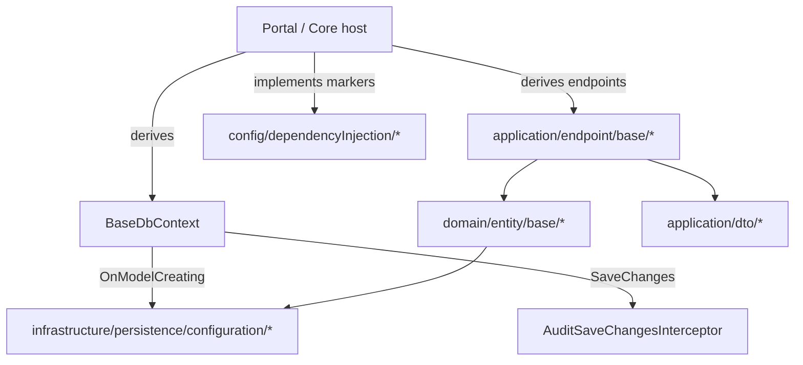

# Sydowwe.Framework — Architecture & Navigation Index

The map an agent reads to decide *which file to open* without reading the whole tree. Paths are relative to `Sydowwe.Framework/`. Layered `domain` (no infra deps) → `application` (endpoints/DTOs) →
`infrastructure` (EF/services) →
`config` (DI markers).

## Layout at a glance

## Core abstractions

| Name                   | Kind                         | Responsibility                                                                                                                                                                                                                       | Path                               |
|------------------------|------------------------------|--------------------------------------------------------------------------------------------------------------------------------------------------------------------------------------------------------------------------------------|------------------------------------|
| `BaseDbContext<TUser>` | abstract `partial` DbContext | `IdentityDbContext<TUser,UserRole,long>` where `TUser : BaseUser`; applies Framework configs; ignores abstract `BaseUser` from EF model; stamps timestamps + `UserId` in `SaveChangesAsync`; `OnModelCreatingPartial` hook for hosts | `infrastructure/BaseDbContext.cs`  |
| `Result` / `Result<T>` | result type                  | Success/failure with `ErrorType`/`ErrorMessage`; `WithData`/`To`/`ToFailed` combinators                                                                                                                                              | `domain/result/Result.cs`          |
| `ResultErrorType`      | enum                         | NotFound, DatabaseError, … (maps to HTTP via `EndpointHelper.ToStatusCode`)                                                                                                                                                          | `domain/result/ResultErrorType.cs` |
| `MyIntTime`            | value type                   | Hours/Minutes/Seconds DTO ↔ `int` seconds persistence                                                                                                                                                                                | `domain/helper/MyIntTime.cs`       |

## Entity hierarchy

| Name                                                                                                     | Kind              | Responsibility                                                                                                                                                                                                                  | Path                                             |
|----------------------------------------------------------------------------------------------------------|-------------------|---------------------------------------------------------------------------------------------------------------------------------------------------------------------------------------------------------------------------------|--------------------------------------------------|
| `BaseEntity`                                                                                             | base              | `long Id` only (`IEntityWithId`); for SQL/materialized views                                                                                                                                                                    | `domain/entity/base/BaseEntity.cs`               |
| `BaseTableEntity`                                                                                        | base              | adds `Created/ModifiedTimestamp`; audited; gets `row_version`                                                                                                                                                                   | `domain/entity/base/BaseTableEntity.cs`          |
| `BaseEntityWithUser`                                                                                     | base              | adds `UserId` only (`IEntityWithUser`; no nav — nav lives in solution-level `BaseEntityWithCoreUser`)                                                                                                                           | `domain/entity/user/BaseEntityWithUser.cs`       |
| `BaseNameTextEntity` / `IBaseNameTextColorEntity` / `BaseTextColorEntity`                                | base              | lookup-style entities (name/text/color)                                                                                                                                                                                         | `domain/entity/base/`                            |
| `SelectOptionBase`                                                                                       | base              | id+text select option projection source                                                                                                                                                                                         | `domain/entity/base/SelectOptionBase.cs`         |
| `BaseUser` / `UserRole` / `RefreshToken`                                                                 | identity entities | `BaseUser` is **abstract** — the concrete user (`CoreUser`) lives in the solution's `Kernel`. One concrete user per deployment maps to the single `user` table. `UserRole` and `RefreshToken` are non-generic (UserId FK only). | `domain/entity/user/`                            |
| `IEntityWithId` / `IEntityWithName` / `IEntityWithIsHidden` / `ISoftDeletableEntity` / `IEntityWithUser` | marker interfaces | capability contracts used by base endpoints/helpers                                                                                                                                                                             | `domain/entityInterface/`, `domain/entity/user/` |

## EF Core persistence

| Name                                                                                                                        | Kind            | Responsibility                                                                                                                                                      | Path                                                                             |
|-----------------------------------------------------------------------------------------------------------------------------|-----------------|---------------------------------------------------------------------------------------------------------------------------------------------------------------------|----------------------------------------------------------------------------------|
| `EntityBuilderExtensions`                                                                                                   | builder ext     | `BaseEntityConfigure`, `EnumColumn`, `FlagsEnumColumn`, `PriceColumn`, `StoredComputedColumn`                                                                       | `infrastructure/persistence/configuration/extensions/EntityBuilderExtensions.cs` |
| ~~EntityWithUserBuilderExtensions~~ (deleted)                                                                               | —               | Nav-based FK helpers removed; solution-level `EntityWithCoreUserBuilderExtensions` (`IsManyWithOneCoreUser` / `IsOneWithOneCoreUser`) live in `AdhdTimeOrganizer`.  | —                                                                                |
| `NameTextColorEntityConfigurationExtension` / `OwnedEntityConfiguration` / `LookupBaseConfiguration`                        | config ext      | shared configuration for name/text/color, owned types, lookups                                                                                                      | `…/configuration/`                                                               |
| `DbContextHelper`                                                                                                           | DbContext ext   | `BaseSaveChangesAsync` + Result-returning CRUD (`AddEntityAsync`, `AddRangeAsync` (tx, chunks of 300), `Update*`, `Delete*`, `DeleteByIdAsync`, `SetActiveStatus*`) | `infrastructure/persistence/DbContextExtensions.cs`                              |
| `UserDbContextExtensions`                                                                                                   | DbContext ext   | `BaseWithUserEntitySaveChangesAsync` — fills `UserId` on insert                                                                                                     | `infrastructure/persistence/UserDbContextExtensions.cs`                          |
| `DatabaseExceptionUtils` (`DbUtils`)                                                                                        | helper          | maps EF/Npgsql exceptions → `Result` errors                                                                                                                         | `infrastructure/persistence/DatabaseExceptionUtils.cs`                           |
| `RetryDbConcurrencyHelper`                                                                                                  | helper          | retry wrapper for `row_version` concurrency conflicts                                                                                                               | `infrastructure/persistence/RetryDbConcurrencyHelper.cs`                         |
| `QueryableEntityExtensions` / `QueryableExtensions` / `OrderQueryableExtensions` / `FilterSortPaginateEnumerableExtensions` | query ext       | filter/sort/paginate + `GetGridDataAsync` projection used by grid endpoints                                                                                         | `infrastructure/extension/`, `infrastructure/persistence/`                       |
| `MaterializedViewExtensions`                                                                                                | query ext       | `RefreshMaterializedViewAsync(string viewName)` — generic concurrent MV refresh; domain-specific wrappers live in their own modules                                 | `infrastructure/extension/MaterializedViewExtensions.cs`                         |
| `MyIntTimeConverter`                                                                                                        | value converter | `MyIntTime` ↔ `int` seconds                                                                                                                                         | `infrastructure/persistence/converter/MyIntTimeConverter.cs`                     |

## Auditing

| Name                                                                 | Kind           | Responsibility                                                                                                                                 | Path                                                                                   |
|----------------------------------------------------------------------|----------------|------------------------------------------------------------------------------------------------------------------------------------------------|----------------------------------------------------------------------------------------|
| `AuditSaveChangesInterceptor`                                        | EF interceptor | captures Add/Modify/Delete on `BaseTableEntity` → `audit_log` (before/after JSONB, changed props, user, correlation id); owns a tx when needed | `infrastructure/persistence/audit/AuditSaveChangesInterceptor.cs`                      |
| `AuditService` / `IAuditService`                                     | service        | `LogAsync(eventType, payload?, …)` for semantic business events → `business_audit_log`                                                         | `infrastructure/extService/AuditService.cs`, `domain/serviceContract/IAuditService.cs` |
| `AuditLog` / `BusinessAuditLog`                                      | entities       | the two audit tables                                                                                                                           | `domain/audit/`                                                                        |
| `NoAuditAttribute` / `AuditIgnoreAttribute`                          | attributes     | skip entity / skip property                                                                                                                    | `domain/audit/`                                                                        |
| `AuditLogEntityConfiguration`                                        | config         | yearly RANGE partitioning (`FirstYear`/`YearCount`), composite PK `(Id,Date)`                                                                  | `infrastructure/persistence/configuration/AuditLogEntityConfiguration.cs`              |
| `PartitionedNpgsqlMigrationsSqlGenerator` / `PartitioningExtensions` | infra          | `IsPartitionedByRange(...)` + migration SQL for partitioned tables                                                                             | `infrastructure/persistence/`                                                          |

## Base endpoints (`application/endpoint/base/`)

Reads use `IProjectionResponse<TResponse,TEntity>` (static `Projection`); writes use `ICreateRequest<TEntity>` / `IUpdateRequest` / patch `Mapping`. All default
`AllowedRoles()` → User+Admin+Root; routes are kebab-cased entity names.

| Name                                                                 | HTTP                      | Responsibility                                                                                                                                                                        | Path                                         |
|----------------------------------------------------------------------|---------------------------|---------------------------------------------------------------------------------------------------------------------------------------------------------------------------------------|----------------------------------------------|
| `BaseCreateEndpoint<TEntity,TRequest>`                               | POST                      | map `req.ToEntity`, save, return new `Id` (201); `Before/AfterMapping`/`AfterSave` hooks                                                                                              | `command/BaseCreateEndpoint.cs`              |
| `BaseUpdateEndpoint<TEntity,TRequest>`                               | PUT `/{id}`               | full update via `IUpdateRequest`                                                                                                                                                      | `command/BaseUpdateEndpoint.cs`              |
| `BasePatchEndpoint<TEntity,TRequest,TResponse>`                      | PATCH `/{id}`             | partial update via `Mapping(entity,req)`                                                                                                                                              | `command/BasePatchEndpoint.cs`               |
| `BaseDeleteEndpoint<TEntity>` / `BaseSoftDeleteEndpoint<TEntity>`    | DELETE `/{id}`            | hard / soft (`ISoftDeletable`) delete                                                                                                                                                 | `command/`                                   |
| `BaseBatchDeleteEndpoint<TEntity>`                                   | POST `/batch-delete`      | delete by id list                                                                                                                                                                     | `command/BaseBatchDeleteEndpoint.cs`         |
| `BaseToggleIsHiddenEndpoint<TEntity>`                                | PATCH `/toggle-is-hidden` | toggle `IEntityWithIsHidden`                                                                                                                                                          | `command/misc/BaseToggleIsHiddenEndpoint.cs` |
| `BaseGetByIdEndpoint<TEntity,TResponse>`                             | GET `/{id}`               | projected single; `AuthorizeAsync`/`PostProcess` hooks (+ opt-in `NotFoundWhenUnauthorized` → a failed authorize answers 404 instead of 403, for ids whose existence is confidential) | `read/BaseGetByIdEndpoint.cs`                |
| `BaseGetAllEndpoint<…>` / `BaseGetAllByParentEndpoint<…>`            | GET                       | projected list (optionally by parent)                                                                                                                                                 | `read/`                                      |
| `BaseGetByFieldEndpoint<…>`                                          | GET `/by-{field}`         | lookup by a field                                                                                                                                                                     | `read/BaseGetByFieldEndpoint.cs`             |
| `BaseGetSelectOptionsEndpoint<…>`                                    | GET `/all-options`        | id+text options                                                                                                                                                                       | `read/BaseGetSelectOptionsEndpoint.cs`       |
| `BaseGridEndpoint<TEntity,TResponse,TFilter>`                        | POST `/filtered-table`    | filter+sort+paginate; abstract `ApplyCustomFiltering`; override `PreprocessSortBy` to remap sort keys before they reach `SortByMany` (e.g. "address" → "addressComputed")             | `read/pageFilterSort/BaseGridEndpoint.cs`    |
| `BaseFilterSortEndpoint` / `BaseFilterEndpoint` / `BaseSortEndpoint` | POST                      | the un-paginated variants; `PreprocessSortBy` override available on sort-capable bases                                                                                                | `read/pageFilterSort/`                       |

## DTO contracts (`application/dto/`)

| Name                                                                                                           | Kind          | Responsibility                                                    | Path                                            |
|----------------------------------------------------------------------------------------------------------------|---------------|-------------------------------------------------------------------|-------------------------------------------------|
| `IProjectionResponse<TResponse,TEntity>`                                                                       | interface     | static-abstract `Projection(IQueryable)` for DB-side read shaping | `dto/response/IProjectionResponse.cs`           |
| `ICreateRequest<TEntity>` / `IUpdateRequest` / `IPatchRequest` / `IFilterRequest`                              | interfaces    | request contracts consumed by base endpoints                      | `dto/request/interface/`                        |
| `BaseFilterSortPaginateRequest<TFilter>` / `BaseFilterSortRequest` / `BaseSortRequest` / `SortPaginateRequest` | request bases | grid/list paging+sort envelopes                                   | `dto/request/base/table/`                       |
| `BaseGridResponse<T>`                                                                                          | response      | `Items` + `ItemsCount` + `PageCount` page                         | `dto/response/base/BaseGridResponse.cs`         |
| `IdRequest` / `IdListRequest` / `SelectOptionResponse` / `ErrorResponse` / `SuccessResponse`                   | generic DTOs  | common request/response shapes                                    | `dto/request/generic/`, `dto/response/generic/` |

## Identity, auth & user

| Name                                                                                                                                                              | Kind      | Responsibility                                                                                                                                                                                                                                                                                                                    | Path                                                             |
|-------------------------------------------------------------------------------------------------------------------------------------------------------------------|-----------|-----------------------------------------------------------------------------------------------------------------------------------------------------------------------------------------------------------------------------------------------------------------------------------------------------------------------------------|------------------------------------------------------------------|
| `BaseLoginEndpoint<TUser>` / `BaseLogoutEndpoint` / `BaseRefreshTokenEndpoint` / `BaseChangePasswordEndpoint<TUser>` / `BaseValidateTwoFactorAuthForLoginEndpoint<TUser>` | endpoints | auth flow; abstract bases, generic over `TUser : BaseUser` where a user object is needed. FastEndpoints only discovers non-abstract types, so each base needs a concrete closure in the host assembly (e.g. `LoginEndpoint : BaseLoginEndpoint<CoreUser>`). `BaseLogoutEndpoint` and `BaseRefreshTokenEndpoint` are non-generic (no user object needed) but still abstract — the Framework assembly is excluded from endpoint discovery, so a concrete endpoint here would never be routed. | `application/endpoint/user/command/auth/`                        |
| `BaseGetCurrentUserEndpoint<TUser>`                                                                                                                               | endpoint  | current-user profile (abstract generic; concrete closure in solution Core)                                                                                                                                                                                                                                                        | `application/endpoint/user/read/GetUserDataEndpoint.cs`          |
| `JwtService<TUser>` / `IJwtService<TUser>` / `IJwtService` (non-generic)                                                                                          | service   | ECDSA JWT issue/validate; generic so `UserManager<TUser>` stays type-safe. `IJwtService` (non-generic) exposes `RefreshTokensAsync`/`SetTokenCookies` for `RefreshTokenEndpoint`. Register via `services.AddScoped(typeof(IJwtService<>), typeof(JwtService<>))`.                                                                 | `infrastructure/extService/user/auth/JwtService.cs`              |
| `TwoFactorAuthService<TUser>` / `ITwoFactorAuthService<TUser>`                                                                                                    | service   | TOTP 2FA; generic over TUser. Register via `services.AddScoped(typeof(ITwoFactorAuthService<User>), typeof(TwoFactorAuthService<>))`.                                                                                                                                                                                             | `infrastructure/extService/user/auth/`                           |
| `RefreshTokenService` / `GoogleRecaptchaService`                                                                                                                  | services  | refresh tokens (non-generic, returns `UserId` only — user loading is in `JwtService<TUser>`); reCAPTCHA                                                                                                                                                                                                                           | `infrastructure/extService/user/auth/`                           |
| `LoggedUserService` / `ILoggedUserService`                                                                                                                        | service   | current user id / roles / `IsAuthenticated`                                                                                                                                                                                                                                                                                       | `infrastructure/extService/user/LoggedUserService.cs`            |
| `UserEmailSenderService` / `EmailSenderService` (MailKit)                                                                                                         | services  | account + generic email                                                                                                                                                                                                                                                                                                           | `infrastructure/extService/`, `…/user/`                          |
| `ClaimsPrincipalExtensions` / `EndpointExtensions`                                                                                                                | helpers   | `GetId()`, `IsAdminOrHigher()`, `GetUserRole/GetAdminRole`                                                                                                                                                                                                                                                                        | `application/extensions/`, `domain/helper/EndpointExtensions.cs` |
| `UserRoleEnum`                                                                                                                                                    | enum      | User · Admin · Root                                                                                                                                                                                                                                                                                                               | `domain/enum/UserRoleEnum.cs`                                    |
| `AuthCookies` / `JwtHelper`                                                                                                                                       | helpers   | cookie names, JWT claim helpers                                                                                                                                                                                                                                                                                                   | `domain/helper/`                                                 |

## DI conventions (`config/dependencyInjection/`)

| Name                                                         | Role                                                                                                                                                                  |
|--------------------------------------------------------------|-----------------------------------------------------------------------------------------------------------------------------------------------------------------------|
| `IScopedService` / `ISingletonService` / `ITransientService` | lifetime markers; scan-registered `AsImplementedInterfaces` in the portal's `AddCore()`                                                                               |
| `IMapperService`                                             | marker registered `AsSelf` (singleton)                                                                                                                                |
| `IDecoratorService`                                          | wrap an existing Core registration via `services.Decorate()`; decorated interface = the one service interface the decorator both implements and takes as a ctor param |

## Seeding (`infrastructure/persistence/seeder/`)

Two orthogonal axes — **scope** (app-wide vs per-user) × **purpose** (`Default` = production,
`Dev` = fixtures) — giving four seeder kinds and four managers. `IDatabaseSeeder` is identity only
(`SeederName`, `Order`); the seeding entry point lives on the leaf interface, because the four kinds
take genuinely different arguments.

| Name                                                                        | Kind       | Responsibility                                                                     | Path                            |
|-----------------------------------------------------------------------------|------------|------------------------------------------------------------------------------------|---------------------------------|
| `IDatabaseSeeder` (+ `IAppWideSeeder` / `IPerUserSeeder` scope markers)      | interfaces | `SeederName`, `Order` — no seeding entry point                                      | `seeder/interface/`             |
| `IAppWideDefaultSeeder`                                                     | interface  | `Seed(bool overrideData)` — prod data, no user owner; **upserts, never truncates**  | `seeder/interface/`             |
| `IPerUserDefaultSeeder`                                                     | interface  | `SetupDefaults(userId, ct)` / `ResetDefaults(userId, ct)` — prod baseline per user  | `seeder/interface/`             |
| `IAppWideDevSeeder`                                                         | interface  | `Seed()` + `TruncateTable()` — fixtures with no single owner                        | `seeder/interface/`             |
| `IPerUserDevSeeder`                                                         | interface  | `SeedForUser(userId)` + `TruncateTable()` — fixtures owned by one user              | `seeder/interface/`             |
| `AppWideDefaultSeederManager` / `PerUserDefaultSeederManager`               | managers   | run ordered; exceptions **propagate** (production data must not fail quietly)       | `seeder/`                       |
| `AppWideDevSeederManager` / `PerUserDevSeederManager`                       | managers   | truncate in reverse `Order` on override, then run ordered; log-and-continue on error | `seeder/`                       |
| `ISeedUserProvider`                                                         | seam       | host supplies user ids (all / root admin / first N) — framework has no user DbSet    | `seeder/ISeedUserProvider.cs`   |
| `SeederResolver`                                                            | internal   | resolve + order + **dedupe by concrete type** (guards against overlapping DI scans)  | `seeder/SeederResolver.cs`      |
| `UserRoleSeeder`                                                            | seeder     | role rows as an `IAppWideDefaultSeeder`; `DefaultUsersSeeder` lives in the host       | `seeder/`                       |
| `SeederExtensions`                                                          | helper     | `TruncateTableAsync` / `…CascadeAsync` (TRUNCATE … RESTART IDENTITY)                 | `seeder/SeederExtensions.cs`    |

**The truncate rule:** only dev seeders declare `TruncateTable`. Default seeders update in place, because
truncating `user_role` or `user` cascades away every user↔role assignment. If your data wants
wipe-and-reinsert, it is a fixture — implement a `…DevSeeder`.

## Misc domain helpers

| Name                                                                                                                                             | Role                                                           | Path                                           |
|--------------------------------------------------------------------------------------------------------------------------------------------------|----------------------------------------------------------------|------------------------------------------------|
| `Helper` / `StringExtensions` / `EnumerableExtensions` / `DateTimeExtensions`                                                                    | string/enumerable/date utilities (incl. PascalCase→snake_case) | `domain/helper/Helper.cs`, `domain/extension/` |
| `Address` / `TitleValueObject`                                                                                                                   | owned value objects                                            | `domain/valueObject/`                          |
| enums (`AppTheme`, `AuthMethod`, `AvailableLocales`, `EqualityOperator`, `LogicalOperator`, `SortDirOption`, `TimeLengthUnit`, `AttachmentType`) | shared enums                                                   | `domain/enum/`                                 |
| exceptions (`NotFoundException`, `UserLockedOutException`, `ReCaptchaException`, `*VariableMissingException`, …)                                 | typed domain exceptions                                        | `domain/exception/`                            |
| `EntityCacheService` / `CacheService` / `LocalizationService` / `SessionService`                                                                 | cross-cutting services                                         | `infrastructure/extService/`                   |
